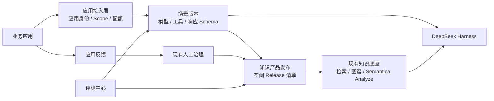

# 传神智库应用底座增强详细设计

## 1. 文档目标

本文定义“传神智库”从知识能力平台升级为可规模化承载业务应用的知识底座所需能力。设计覆盖五个首期模块：

1. 应用中心与服务凭据。
2. 知识产品与发布通道。
3. 场景配置与结构化 Agent Profile。
4. 知识服务评测中心。
5. 用户反馈与人工治理闭环。

同时定义应用级调用观测、事件扩展、数据库迁移、权限、安全和测试要求。本文是增量设计，不改变以下权威边界：

- PostgreSQL/FastAPI 继续是租户、用户、空间权限和知识发布的权威入口。
- Semantica 继续负责解析、切片、抽取、归一化、Provenance、RRF 和 Datalog 推理。
- DeepSeek Harness 继续负责 Agent Loop、Session Event、工具编排和流式回答。
- OpenSearch、Qdrant、FalkorDB 继续是可重建投影。
- 应用不得直接访问数据库、MinIO 或检索中间件。

## 2. 设计结论

现有“知识空间”是治理和权限边界，但不是适合应用长期依赖的发布契约。应用不应直接绑定一组可随时变化的空间、模型 ID、规则集 ID和检索参数。本轮在应用和现有知识服务之间增加薄管理层：



核心原则：

- 应用通过 `application_code + scenario_code` 调用稳定业务契约。
- 场景版本引用知识产品发布，不复制知识内容。
- 知识产品发布引用现有 `KnowledgeRelease`，不复制图谱或索引。
- 评测调用现有 `/search`、Harness 和引用校验，不维护另一套检索。
- 反馈复用现有 `CurationCase`、`CurationDecision` 和发布回滚链。

## 3. 范围与阶段

### A0：首个应用前必须完成

- 应用 CRUD、启停、所有者和环境管理。
- 服务凭据签发、轮换、撤销和短期 Token。
- 应用对知识产品、场景和工具的最小权限授权。
- 知识产品 CRUD、空间组成、发布快照、测试/生产别名和回滚。
- 场景 CRUD、不可变版本、检索策略、工具白名单和响应 Schema。
- 评测集、评测用例、检索评测运行和发布门禁基础。
- 回答反馈、问题分类、治理 Case 转换和处理状态。
- 应用调用记录、延迟、错误、降级和 Token 使用投影。

### A1：随首个应用完善

- Harness Agent 评测运行。
- 场景灰度流量和 A/B 对比。
- 参数化知识函数自动发布为 REST/MCP/Harness Tool。
- 事件 Outbox、签名 Webhook、重试与死信。
- 用户身份委托和文档/Chunk 级访问策略。

### A2：正式组织级推广前

- 统一身份、组织同步、密级与脱敏策略。
- 多实例容量、容灾、限额和生产 SLA。
- 更复杂的 Datalog 白名单 Builtin：数值、日期、时间窗口、聚合和否定。

Google Drive、OneDrive/SharePoint、Snowflake 和性能专项不属于本轮范围。

## 4. 模块一：应用中心

### 4.1 业务定位

应用中心管理“谁在调用知识、能调用什么、以什么方式调用、发生问题后如何追溯”。它不承载业务应用页面，也不执行应用工作流。

### 4.2 数据模型

#### `applications`

| 字段 | 类型 | 说明 |
|---|---|---|
| id | UUID | 主键 |
| tenant_id | UUID | 租户 |
| code | varchar(100) | 租户内唯一稳定编码 |
| name | varchar(200) | 应用名称 |
| description | text | 业务用途 |
| app_type | enum | `web/backend/agent/integration` |
| environment | enum | `development/testing/production` |
| owner_id | UUID | 应用负责人 |
| org_unit_id | UUID? | 所属组织 |
| status | enum | `draft/active/suspended/retired` |
| config | JSON | 回调、联系信息等非敏感配置 |
| enabled | bool | 是否可用 |
| created_at/updated_at/deleted_at | timestamp | 审计字段 |

唯一约束：`tenant_id + code`。

#### `application_credentials`

| 字段 | 类型 | 说明 |
|---|---|---|
| id | UUID | 主键 |
| application_id | UUID | 所属应用 |
| tenant_id | UUID | 冗余租户边界 |
| name | varchar(200) | 凭据用途 |
| client_id | varchar(80) | 全局唯一公开标识 |
| secret_prefix | varchar(16) | 页面识别，不是 Secret |
| secret_hash | varchar(300) | Scrypt Hash，不可解密 |
| scopes | JSON | `knowledge.search/chat/fragment/graph/reason/profile` |
| expires_at | timestamp? | 到期时间 |
| last_used_at | timestamp? | 最近调用 |
| rotated_from_id | UUID? | 轮换来源 |
| revoked_at | timestamp? | 撤销时间 |

Client Secret 只在创建/轮换时返回一次。数据库不保存可回显密文，日志仅记录 `client_id` 和前缀。

#### `application_grants`

| 字段 | 类型 | 说明 |
|---|---|---|
| application_id | UUID | 应用 |
| resource_type | enum | `knowledge_product/scenario` |
| resource_id | UUID | 资源 |
| permission | enum | `invoke/read/manage` |
| effect | enum | `allow/deny` |

### 4.3 认证协议

```http
POST /api/v1/application-auth/token
Content-Type: application/json

{
  "client_id": "app_xxx",
  "client_secret": "仅创建时可见的 Secret"
}
```

返回 15 分钟短期 JWT：

```json
{
  "access_token": "...",
  "token_type": "bearer",
  "expires_in": 900,
  "application_id": "...",
  "scopes": ["knowledge.search", "knowledge.chat"]
}
```

JWT 必须包含 `sub=application_id`、`tenant_id`、`client_id`、`scope`、`jti`、`iat`、`exp`。服务端每次调用重新校验应用、凭据和授权状态；应用被停用或凭据撤销后，已签发 Token 应被拒绝。

### 4.4 管理 API

```text
GET    /api/v1/applications
POST   /api/v1/applications
GET    /api/v1/applications/{id}
PUT    /api/v1/applications/{id}
DELETE /api/v1/applications/{id}
POST   /api/v1/applications/{id}/credentials
GET    /api/v1/applications/{id}/credentials
POST   /api/v1/applications/{id}/credentials/{credential_id}/rotate
DELETE /api/v1/applications/{id}/credentials/{credential_id}
POST   /api/v1/applications/{id}/grants
GET    /api/v1/applications/{id}/grants
DELETE /api/v1/applications/{id}/grants/{grant_id}
```

凭据删除使用撤销，不物理删除审计记录。

## 5. 模块二：知识产品与发布中心

### 5.1 业务定位

知识产品是应用消费知识的稳定边界。一个知识产品可组合多个知识空间，并定义检索策略、元数据过滤、开放工具、评测门禁和发布别名。

### 5.2 数据模型

#### `knowledge_products`

| 字段 | 类型 | 说明 |
|---|---|---|
| id/tenant_id | UUID | 主键与租户 |
| code/name/description | text | 稳定编码与业务说明 |
| owner_id | UUID | 产品负责人 |
| status | enum | `draft/active/retired` |
| default_retrieval_policy | JSON | Top K、通道、过滤、重排 |
| allowed_tools | JSON | 对外开放工具白名单 |
| quality_gate | JSON | 发布必须满足的评测条件 |
| enabled | bool | 是否可用 |

#### `knowledge_product_spaces`

关联产品与空间，并保存顺序、是否必需和产品级固定过滤条件。创建/更新时必须验证操作者对所有空间拥有 `manage` 权限。

#### `knowledge_product_releases`

产品 Release 是不可变清单：

```json
{
  "spaces": [
    {
      "space_id": "...",
      "knowledge_release_id": "...",
      "release_number": 18,
      "checksum": "..."
    }
  ],
  "ontology_versions": [],
  "retrieval_policy_version": 3
}
```

字段包括 `release_number`、`manifest`、`checksum`、`status`、`validation_report`、`published_by`、`published_at`。发布时只引用现有 `KnowledgeRelease`，不复制索引、图谱、Chunk 或 Fact。

#### `knowledge_product_aliases`

| alias | 用途 |
|---|---|
| development | 开发联调 |
| testing | 自动化/业务验收 |
| production | 正式应用调用 |

唯一约束：`product_id + alias`。别名移动记录操作人、旧 Release、新 Release、原因和时间。

### 5.3 发布流程

```text
选择空间当前 KnowledgeRelease
→ 生成不可变产品 Manifest
→ 校验 Release 均有效且属于同一租户
→ 运行绑定评测集
→ 计算质量门禁
→ 创建产品 Release
→ 手工或自动移动 testing/production Alias
→ 写入审计与事件 Outbox
```

生产别名移动失败时旧版本继续提供服务。应用查询必须把 `product_release_id` 写入 QueryRun、Conversation 和 Citation 快照。

### 5.4 API

```text
GET/POST/PUT/DELETE /api/v1/knowledge-products
GET/POST/PUT/DELETE /api/v1/knowledge-products/{id}/spaces
GET  /api/v1/knowledge-products/{id}/releases
POST /api/v1/knowledge-products/{id}/releases
GET  /api/v1/knowledge-product-releases/{id}/diff
GET  /api/v1/knowledge-products/{id}/aliases
PUT  /api/v1/knowledge-products/{id}/aliases/{alias}
POST /api/v1/knowledge-products/{id}/aliases/{alias}/rollback
```

## 6. 模块三：场景配置中心

### 6.1 业务定位

场景是应用调用知识能力的稳定执行契约。业务应用只提供 `scenario_code` 和输入，不需要传模型 ID、空间 ID、规则集 ID 或工具细节。

### 6.2 数据模型

#### `application_scenarios`

- `tenant_id/application_id/knowledge_product_id`
- `code/name/description/category`
- `status=draft/active/retired`
- `active_version_id`
- `enabled`

#### `application_scenario_versions`

场景版本不可修改，编辑产生新版本：

| 配置 | 内容 |
|---|---|
| product_alias | 默认 `production` |
| model_config_id | 平台模型配置 |
| agent_profile | 最大 Step、超时、温度等 |
| system_policy | 简洁业务约束，不保存 Secret |
| tool_allowlist | Harness 知识工具白名单 |
| retrieval_policy | 通道、Top K、过滤、重排 |
| rule_set_ids | 可调用的 Semantica 规则集 |
| response_schema | JSON Schema；空表示文本回答 |
| citation_policy | 是否必需、最少证据、无证据行为 |
| fallback_policy | 通道/模型失败时行为 |
| version_note | 变更说明 |

### 6.3 场景调用

文本/SSE：

```http
POST /api/v1/application-runtime/scenarios/{scenario_code}/chat
Authorization: Bearer APPLICATION_TOKEN

{
  "message": "该供应商是否需要持续监测？",
  "conversation_key": "业务侧稳定会话标识",
  "context": {"supplier_name": "华东算力设备有限公司"}
}
```

结构化执行：

```http
POST /api/v1/application-runtime/scenarios/{scenario_code}/invoke

{
  "input": {"supplier_name": "华东算力设备有限公司"}
}
```

结构化输出必须通过 JSON Schema 校验。失败时返回明确错误，不得用无法解析的自然语言伪装结构化成功。

### 6.4 Harness 边界

- 场景工具仍通过 out-of-tree Harness 插件注册。
- 场景版本决定工具白名单，不能修改 Harness 核心 Agent Loop。
- Harness 使用场景凭据换取短期 Knowledge Tool Token。
- FastAPI 在每次工具调用时重新校验应用、场景、产品 Alias 和空间范围。
- Session Event 增加 `application_id/scenario_id/scenario_version/product_release_id` 审计字段，但不暴露 Secret。

## 7. 模块四：知识服务评测中心

### 7.1 评测对象

评测必须同时覆盖：

1. 检索质量。
2. 引用质量。
3. 回答事实与拒答行为。
4. 多轮上下文。
5. 结构化输出 Schema。
6. 性能、降级和模型用量。

### 7.2 数据模型

#### `evaluation_datasets`

保存名称、业务领域、负责人、适用知识产品、适用场景、状态和版本。

#### `evaluation_cases`

| 字段 | 说明 |
|---|---|
| question | 用户问题 |
| conversation_turns | 可选历史轮次 |
| expected_chunk_ids | 必须召回的证据 |
| expected_document_ids | 可接受来源 |
| expected_facts | 必须包含的结构化事实 |
| forbidden_facts | 禁止生成的事实 |
| expected_behavior | `answer/refuse/clarify` |
| assertions | 业务断言和阈值 |

#### `evaluation_runs`

必须绑定 `dataset_version + scenario_version + product_release_id + model_config_id`，避免结果失去可复现条件。

#### `evaluation_case_results`

保存 QueryRun、Harness Turn、召回排名、引用、回答、断言结果、耗时、Token 和失败原因。

### 7.3 指标

确定性指标优先：

- Recall@K、MRR、NDCG。
- 必需 Chunk 命中率。
- 引用存在率、引用权限有效率、引用排序一致性。
- 预期事实覆盖率和禁止事实命中数。
- 无依据问题拒答率。
- JSON Schema 通过率。
- 终态、超时、降级和错误率。

模型评分只作为辅助字段，不能覆盖确定性失败。

### 7.4 发布门禁

知识产品可配置：

```json
{
  "dataset_ids": ["..."],
  "min_recall_at_5": 0.85,
  "min_citation_validity": 1.0,
  "max_forbidden_fact_count": 0,
  "max_failure_rate": 0.02
}
```

未达门禁的 Release 可以保存在 `testing`，不得移动到 `production`。管理员强制发布必须填写原因并进入审计。

## 8. 模块五：反馈与治理闭环

### 8.1 反馈类型

- `helpful`
- `incorrect_answer`
- `incomplete_answer`
- `incorrect_citation`
- `outdated_knowledge`
- `missing_knowledge`
- `permission_issue`
- `other`

### 8.2 `application_feedback`

每条反馈关联：

- application/scenario/scenario_version。
- conversation/message/query_run。
- product_release。
- 可选 citation/chunk/document/entity/fact。
- 用户评分、说明、建议答案。
- 状态 `open/triaged/converted/resolved/ignored`。
- 处理人、处理说明、关联 `curation_case_id`。

### 8.3 转治理 Case

```text
反馈提交
→ 服务端校验反馈对象属于本次回答
→ 反馈分类和去重
→ 管理员选择“转治理任务”
→ 创建或关联 CurationCase
→ 复用现有 Decision/Overlay 修改
→ 发布 KnowledgeRelease
→ 重跑受影响评测用例
→ 反馈标记 resolved
```

反馈不能直接修改自动结果、Chunk、实体或 Fact。

### 8.4 API

```text
POST /api/v1/application-feedback
GET  /api/v1/application-feedback
GET  /api/v1/application-feedback/{id}
PUT  /api/v1/application-feedback/{id}
POST /api/v1/application-feedback/{id}/convert-to-curation
POST /api/v1/application-feedback/{id}/resolve
```

应用 Token 只能创建和读取本应用反馈；治理人员按租户权限处理。

## 9. 应用调用观测

新增 `application_invocations`，每次应用调用只保存可审计摘要：

- request_id、application/scenario/product_release。
- 调用类型 `search/chat/invoke/tool`。
- QueryRun、Conversation、Message、Harness Session 关联。
- 状态、HTTP 状态、错误码、降级通道。
- 总耗时及各阶段耗时。
- Prompt/Completion/Total Token。
- 模型配置 ID，不保存 API Key。
- 引用数、用户反馈状态。

运营中心按应用聚合调用量、成功率、P50/P95、无证据率、降级率、Token 和反馈。首期不引入新的监控中间件，复用 PostgreSQL 投影和现有运营页面。

## 10. 事件与扩展

A1 引入 `event_outbox` 与 `webhook_subscriptions`。Outbox 与业务事务同时提交，再由 Worker 异步投递，防止发布成功但通知丢失。

事件至少包括：

- `knowledge_product.release.created`
- `knowledge_product.alias.changed`
- `knowledge_product.alias.rolled_back`
- `scenario.version.activated`
- `evaluation.run.completed`
- `application_feedback.created`
- `application_feedback.resolved`

Webhook 使用 HMAC 签名、事件 ID 去重、指数退避、最大重试和死信状态。Webhook 地址必须执行 SSRF 校验。

## 11. 权限矩阵

| 操作 | 平台管理员 | 产品负责人 | 应用负责人 | 应用 Token | 普通用户 |
|---|---:|---:|---:|---:|---:|
| 管理应用 | 是 | 否 | 自有应用 | 否 | 否 |
| 管理凭据 | 是 | 否 | 自有应用 | 否 | 否 |
| 管理知识产品 | 是 | 自有产品 | 否 | 否 | 否 |
| 创建产品 Release | 是 | 自有产品 | 否 | 否 | 否 |
| 移动 production | 是 | 有门禁时允许 | 否 | 否 | 否 |
| 管理场景 | 是 | 可查看 | 自有应用 | 否 | 否 |
| 调用场景 | 是 | 是 | 是 | 按 Grant | 按现有用户权限 |
| 创建反馈 | 是 | 是 | 是 | 本应用 | 是 |
| 转治理 Case | 是 | 治理权限 | 否 | 否 | 否 |
| 运行评测 | 是 | 产品/场景权限 | 应用权限 | 否 | 否 |

任何应用 Grant 都不能扩大知识空间原有权限。产品创建者必须对产品空间具备管理权限；应用运行范围为“应用 Grant、产品 Manifest、场景工具白名单”三者交集。

## 12. 数据库迁移

首期新增 `0016_application_foundation.sql`，必须：

- 仅创建新表和可空外键，不删除或重命名现有列。
- 为租户、应用、场景、状态、时间增加索引。
- 所有租户内业务编码增加唯一约束。
- QueryRun、Conversation 增加可空的应用/场景/产品 Release 关联。
- Migration 可重复执行，由现有 `schema_migrations` 管理。
- 既有会话、QueryRun 和知识 Release 保持有效。
- SQLite 单元测试通过 SQLAlchemy `create_all` 创建同构模型。

## 13. 前端信息架构

新增一个主导航分组“应用支撑”，不把五个模块全部堆到一级导航：

```text
应用支撑
├── 应用中心
├── 知识产品
├── 场景配置
├── 质量评测
└── 反馈中心
```

页面规则：

- 白底、浅灰边框、紧凑企业风格。
- 所有配置支持增删改查。
- Secret 只在创建时显示一次，并提供复制与已保存确认。
- 产品 Release、场景版本和评测运行均不可原地修改。
- production 别名移动、凭据撤销、应用停用必须确认。
- 页面不展示 UUID、原始 JSON、JWT、Hash 或内部错误堆栈。
- JSON Schema、产品 Manifest 等技术内容放在默认收起的“技术信息”。

## 14. 向后兼容

- 现有用户 `/search`、`/conversations`、MCP 和 CLI 行为不变。
- 不带应用上下文的 QueryRun、Conversation 继续允许关联字段为空。
- 现有空间权限继续作为用户入口权威。
- 现有 MCP 仍使用用户 Token；后续增加应用 Token，不替换用户方式。
- Harness 内部凭据继续会话级短期签发。
- 知识产品 Release 只引用现有 KnowledgeRelease，不改变索引命名和当前发布流程。

## 15. 安全要求

- Client Secret 使用 Scrypt Hash，明文只返回一次。
- 应用 JWT 使用独立 `aud=chuanshen-application`，不能冒充用户 JWT 或 Agent JWT。
- 日志和审计只保存 `client_id`、JTI 和 Secret 前缀。
- Token 过期、凭据撤销、应用停用、Grant 删除均需测试。
- 应用不得自选未授权空间、模型、规则集、工具或产品 Release。
- 场景 Context 属于不可信输入，必须 Schema 校验、长度限制和 HTML 转义。
- 知识内容继续视为不可信证据，不得覆盖系统策略。
- 反馈说明和建议答案必须执行 XSS 过滤，不能成为 Agent 指令。

## 16. 测试与验收矩阵

### 单元测试

- 应用、知识产品、场景、评测、反馈 Schema。
- Secret Hash、一次性回显、轮换、撤销和 JWT Audience。
- 应用 Grant 与产品/场景范围交集。
- 产品 Manifest Checksum、Alias 移动和回滚。
- 场景版本不可变和 Response Schema 校验。
- Recall@K、MRR、NDCG、引用有效率和禁止事实断言。
- 反馈对象归属、去重、转治理 Case。
- QueryRun/Conversation 向后兼容。

### API E2E

1. 创建应用并完成 CRUD。
2. 创建凭据，验证 Secret 只显示一次。
3. 换取应用 Token。
4. 创建知识产品并关联验收空间。
5. 创建产品 Release 和 testing/production Alias。
6. 创建场景和两个版本，激活新版本。
7. 应用调用搜索、图谱和结构化场景。
8. 验证未授权产品、场景、工具和空间均为 403。
9. 创建评测集和用例，执行真实检索评测。
10. 门禁失败时拒绝移动 production。
11. 提交错误引用反馈并转为 CurationCase。
12. 完成治理后重跑评测并解决反馈。
13. 撤销凭据后旧 Token 立即失效。
14. 删除测试数据，保留不可变审计记录。

### 浏览器

- 五个应用支撑页面全部 CRUD。
- 凭据只显示一次且不出现在后续详情。
- 产品空间选择、Release、Alias、回滚可操作。
- 场景配置不要求用户手写空间 ID、模型 ID 或规则 ID。
- 评测结果展示通过/失败、证据命中和指标，不展示原始 JSON。
- 反馈可以定位真实会话、引用和文档并进入治理工作台。
- 1280×720、1440×900 无横向溢出，控制台无错误。

### 冷启动

- 不删除 Volume 停启全部服务。
- 应用、凭据状态、产品 Alias、场景版本、评测结果和反馈保持。
- 旧会话与旧检索不受影响。
- Migration 重复启动不报错。

## 17. 交付顺序

| 里程碑 | 交付物 | 可页面验收 |
|---|---|---|
| AF-M1 | 应用中心、凭据、Grant、应用 Token | 应用和凭据完整 CRUD |
| AF-M2 | 知识产品、产品 Release、Alias | 创建产品并绑定当前知识发布 |
| AF-M3 | 场景、版本、应用运行入口 | 使用应用 Token 调用固定场景 |
| AF-M4 | 评测集、确定性检索评测、门禁 | 页面运行评测并阻止不合格发布 |
| AF-M5 | 反馈、治理 Case、应用观测 | 回答反馈进入治理并闭环 |

每个里程碑都要完成数据库迁移、API、前端、权限、单元测试、Docker 重建和浏览器点击后才能进入下一阶段。

## 18. 首个应用建议

首个应用建议选择“内部制度与产品知识助手”：

- 风险低，回答可通过文档、页码和引用核验。
- 可复用当前验收数据和四轮问答测试。
- 可以验证应用 Token、知识产品 Release、场景版本、评测和反馈完整闭环。
- 不依赖统一身份、密级、ASR/Vision 或复杂数值规则。

首个评测集建议不少于 50 个问题，包含：明确事实、跨文档比较、指代追问、无答案拒答、错误前提、权限边界和版本变化。
