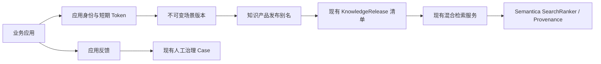

# 应用底座 A0 实现与验收记录

## 1. 交付结论

本轮在现有知识底座上完成了可供后续业务场景复用的 A0 应用支撑层。实现没有复制 Semantica 的解析、检索或推理算法，也没有让应用直接连接 PostgreSQL、OpenSearch、Qdrant 或 FalkorDB。

业务调用链为：



页面入口已进一步业务化为“应用构建”，按照应用工作台、知识供给、能力场景、上线测试、接入发布和运行反馈组织操作；后台继续使用本节所述 A0 对象。所有页面操作均调用真实 FastAPI 接口；凭据 Secret 仅在创建或轮换时显示一次。详细交互见 [应用构建工作台业务化改造](APPLICATION_BUILDER_UX.md)。

## 2. 已实现模块

| 模块 | 业务能力 | 真实实现 |
|---|---|---|
| 应用中心 | 应用 CRUD、启停、环境、负责人、服务凭据、显式资源授权 | Scrypt 单向哈希 Secret；应用 JWT；凭据撤销后已签发 Token 立即失效 |
| 知识产品 | 多知识空间组合、不可变发布、开发/测试/生产别名 | 发布清单引用现有 `KnowledgeRelease`，不复制索引或图谱；别名变更保留历史 |
| 场景配置 | 场景 CRUD、不可变版本、检索策略、工具白名单、响应 Schema | 运行时按场景版本和产品别名解析知识 Release；场景必须得到应用显式授权 |
| 质量评测 | 数据集/用例 CRUD、真实检索运行、结果明细、发布门禁 | 调用现有混合检索；计算 Recall@K、MRR、NDCG@K；保存逐用例结果与调用轨迹 |
| 反馈中心 | 用户/应用反馈、状态与指派、删除、转人工治理 | 反馈可转换为现有 `CurationCase`，继续复用人工治理、发布和回滚链路 |
| 调用观测 | 请求、场景版本、产品发布、耗时、结果数、降级与错误 | 每次应用场景调用保存 `ApplicationInvocation`，不记录 Secret 和全文请求内容 |

## 3. 复用边界

### 3.1 Semantica

- 检索仍通过平台现有 `execute_hybrid_search`，最终融合继续使用 Semantica `SearchRanker`。
- 知识产品只固定已有知识发布的 ID 和校验和，底层仍由现有 Semantica 加工、Provenance、图谱与向量发布链产生。
- 反馈转换后的治理继续作用于 Semantica 自动结果之上的人工约束层，不覆盖原始解析、抽取或推理结果。
- 后续分析类场景继续引用现有 Semantica Analyze/Datalog 场景，不在应用底座重复实现规则引擎。

### 3.2 DeepSeek Harness

- A0 先发布结构化检索场景运行时；对话场景的数据模型、工具白名单和响应 Schema 已保留。
- 后续对话应用应通过现有 FastAPI 会话接口进入 DeepSeek Harness；Harness 仍只能调用 Knowledge Tool API。
- 本轮没有修改 Harness Agent Loop，也没有把模型配置或 API Key 写入场景版本。

## 4. 数据与版本模型

迁移 `0016_application_foundation.sql` 新增以下表：

| 领域 | 表 |
|---|---|
| 应用身份 | `applications`、`application_credentials`、`application_grants` |
| 知识产品 | `knowledge_products`、`knowledge_product_spaces`、`knowledge_product_releases`、`knowledge_product_release_items`、`knowledge_product_aliases`、`knowledge_product_alias_history` |
| 场景 | `application_scenarios`、`application_scenario_versions` |
| 评测 | `evaluation_datasets`、`evaluation_cases`、`evaluation_runs`、`evaluation_case_results` |
| 反馈与观测 | `application_feedback`、`application_invocations` |

约束原则：

- 所有业务记录携带租户边界；关键编码在租户内唯一。
- 发布和场景版本不可变；修改配置会创建新版本。
- 产品 Release 固定每个空间的 `KnowledgeRelease` 与 checksum。
- 场景运行时先解析产品别名，再记录实际使用的不可变 Release，便于追溯。
- 删除使用软删除或撤销，版本、凭据使用记录和调用审计不会被物理擦除。

## 5. 应用认证与最小权限

### 5.1 创建凭据

管理员在“应用中心”创建凭据并选择 Scope。响应中的 `client_secret` 只出现一次；数据库只保存 Scrypt Hash、可识别前缀和 Client ID。

### 5.2 换取短期 Token

```http
POST /api/v1/application-auth/token
Content-Type: application/json

{
  "client_id": "<创建凭据后获得>",
  "client_secret": "<仅显示一次的 Secret>",
  "scope": "scenario.invoke"
}
```

Token 默认有效期 15 分钟，包含应用、凭据、租户、Scope、JTI 和受众。运行时会再次检查：

1. 应用是否启用且状态为 active。
2. 凭据是否撤销或过期。
3. Token Scope 是否包含所需操作。
4. 应用是否获得当前场景的 invoke 授权。
5. 应用是否获得场景所用知识产品的 read 授权。
6. 场景、产品别名和发布是否仍有效。

因此撤销凭据后，不需要等待 JWT 到期，已有 Token 会立即被拒绝。

## 6. 核心接口

### 6.1 管理接口

- `/api/v1/applications`：应用 CRUD。
- `/api/v1/applications/{id}/credentials`：凭据列表、创建、轮换和撤销。
- `/api/v1/applications/{id}/grants`：应用资源授权。
- `/api/v1/knowledge-products`：知识产品 CRUD。
- `/api/v1/knowledge-products/{id}/releases`：创建和查看不可变发布。
- `/api/v1/knowledge-products/{id}/aliases/{alias}`：移动 development/testing/production 别名。
- `/api/v1/application-scenarios`：场景 CRUD。
- `/api/v1/application-scenarios/{id}/versions`：场景版本。
- `/api/v1/evaluation-datasets`、`/evaluation-cases/*`、`/evaluation-runs`：质量评测。
- `/api/v1/application-feedback`：反馈处理与人工治理转换。
- `/api/v1/application-invocations`：应用调用审计。

### 6.2 应用运行时

```http
GET  /api/v1/application-runtime/whoami
POST /api/v1/application-runtime/scenarios/{scenario_code}/search
POST /api/v1/application-runtime/feedback
```

检索场景请求示例：

```json
{
  "query": "产品的主要定位是什么？",
  "filters": {}
}
```

返回沿用现有混合检索结构，并增加实际场景版本、知识产品发布版本、checksum 和应用请求 ID。各通道分数、RRF 结果、排序、引用定位和 Warning 均来自真实检索执行。

## 7. 质量评测

评测用例至少包含问题和期望 Chunk ID，可选期望文档 ID、必含词和标签。运行过程对每条用例执行真实场景检索并保存排名明细。

指标定义：

- Recall@K：期望 Chunk 是否进入前 K。
- MRR：第一个期望 Chunk 排名的倒数。
- NDCG@K：多个期望 Chunk 在排序位置上的折损累计增益。
- Gate：按照数据集配置的最低 Recall、MRR、NDCG 和最高错误率判定。

本轮没有用静态结果或 Mock 冒充在线评测；也未在未配置 Judge 模型时宣称已进行 LLM 评分。

## 8. 真实验收数据

平台保留以下非敏感验收对象，便于后续继续开发应用场景：

| 对象 | 编码 | 状态 |
|---|---|---|
| 应用 | `foundation_acceptance` | active；测试凭据已全部撤销 |
| 知识产品 | `acceptance_knowledge` | 已创建 V1，production 指向 V1 |
| 场景 | `acceptance_search` | active；已发布 V1并授权给验收应用 |
| 评测集 | `acceptance_quality` | 1 条真实用例；最近运行通过 |

真实评测问题为“NexusOne产品的主要定位是什么？”，运行结果 Recall@K、MRR、NDCG@K 均为 1，Gate 通过。浏览器产生的临时服务 Secret 没有写入文档或日志，验收结束后已通过正式撤销接口失效。

## 9. 测试留痕

| 测试层 | 覆盖内容 |
|---|---|
| 单元/API | 130/130 通过；覆盖应用与凭据、Scope 越权、即时撤销、产品发布、场景版本、授权、评测指标、反馈转治理、迁移和 UI 入口 |
| Semantica/平台合约 | 19/19 通过；本轮未替换或绕过现有 Semantica 适配层 |
| PostgreSQL 升级 | 在保留现有 Volume 的条件下从当前数据库升级到 `0016`；重复启动不重复迁移 |
| 真实运行时 | 应用换取 Token，调用 `acceptance_search`，三路检索返回真实排序结果和调用记录；测试凭据随后撤销 |
| 浏览器点击 | 创建应用、一次性凭据弹窗、产品发布与 production 别名、场景版本、应用授权、评测用例与运行、反馈转治理 |
| 响应式 | 1280×720 和 1440×900 下应用中心双栏无横向溢出；CSS 静态资源已使用独立版本号防止旧缓存 |
| 数据保护 | 升级后现有 20 份文档和会话数据仍在；未删除 Docker Volume |

## 10. 当前边界与下一步

已完成 A0 中“先支撑应用落地”的稳定契约。以下内容有意留在下一阶段，不应误认为已完成：

1. 对话、分析和工作流场景的统一 `/invoke` 分发仍需接入现有 DeepSeek Harness 与 Semantica Analyze；本轮正式运行时只开放 search。
2. Harness Agent 自动化质量评测、LLM Judge、灰度流量和 A/B 对比尚未开放。
3. 签名 Webhook、Outbox、重试和死信队列尚未实现。
4. 用户委托身份、文档/Chunk 级 ABAC、统一身份和密级策略属于组织级推广阶段。
5. 用户已明确暂缓性能专项及 Google Drive、OneDrive/SharePoint、Snowflake 接入。

开始开发首个应用场景前，应先为场景建立知识产品、production 发布别名、真实评测集和应用授权，再通过稳定 `scenario_code` 接入；不要让应用直接绑定空间 ID 或检索中间件。
