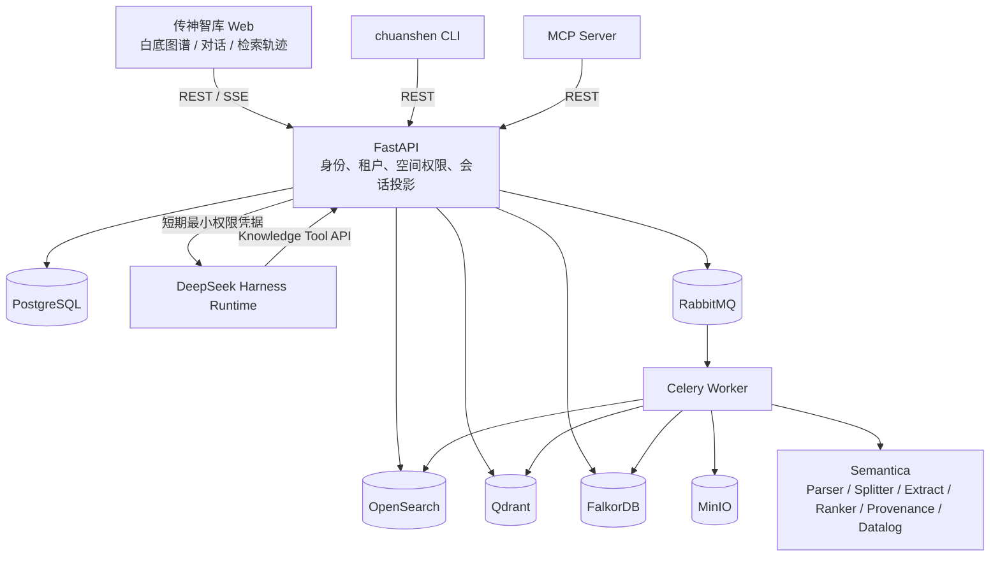
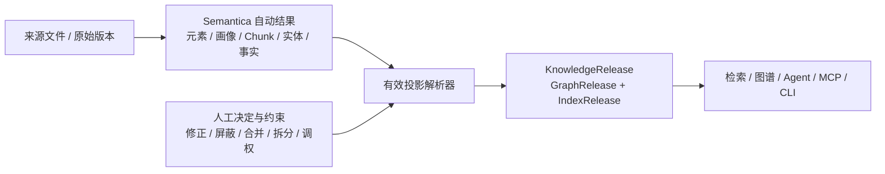

# 系统架构

## 权威边界

- FastAPI/PostgreSQL 是用户、租户、知识空间、文档、会话映射和权限的唯一权威入口。
- 外部索引是可重建投影。每个检索命中都再次解析到 PostgreSQL Chunk，并校验租户、空间、文档未删除、Chunk 已发布和当前版本；旧索引命中会被 fail-closed 过滤。
- 删除文档后保留 Chunk 作为历史引用证据，退役其 Fact，并发布新的 FalkorDB/OpenSearch/Qdrant 当前快照。旧对话引用可打开且返回 `document_deleted=true`。
- Harness 不连接 PostgreSQL、MinIO、OpenSearch、Qdrant 或 FalkorDB，只能使用带会话、用户、租户、空间和过期时间的内部 JWT 调用知识工具。
- MCP 也只调用 FastAPI。浏览器从不直连 Harness。

## 文档加工状态

上传/同步 → 安全校验 → 对象存储 → 解析/OCR/ASR → ContentElement → 稳定 Chunk/Hash → 语义抽取 → 治理画像 → Graph 发布 → Search 发布。Worker 按真实阶段更新百分比；模型治理失败保留解析结果和确定性评分，并允许重试。

版本更新比较文件 SHA-256、元素稳定 ID 和 Chunk 内容 Hash。未变化 Chunk 复用抽取结果与向量；新发布成功前旧发布继续服务，检索只读取文档当前版本。

## 自动治理与人工治理

人工治理不修改 Semantica 自动产物。平台保留四层数据：不可变来源与版本、Semantica 自动结果、人工决定与约束、面向检索和图谱的有效投影。`CurationDecision` 是追加式业务事实，`CurationOverlay` 只保存当前生效指针；回滚恢复上一个决定或自动值。

内容元素修正会重新进入 Semantica Splitter、语义抽取和治理链；Chunk 修正只影响检索投影；实体/事实决定在 FalkorDB 发布前合成。实体 must-link/cannot-link 同时传入 Semantica 归一化聚类，并在后续重加工时用于规范实体映射，避免已合并实体再次生成。人工屏蔽证据后，依赖它的推导事实会被失效，再由后续推理运行重算。

Semantica Analyze/Datalog 和只读 SPARQL 同样读取有效实体、有效事实与人工名称；人工屏蔽、关系修正或实体合并不会只影响图谱页面而遗漏规则推理。

## 会话与事件

Harness 的 append-only Session JSONL 是 Agent 上下文权威源；平台保存业务会话映射、消息只读投影、检索轨迹与引用投影。SSE 事件包括 `turn_started`、`step_started`、`retrieval_started`、`tool_started`、`tool_finished`、`retrieval_ranked`、`answer_delta`、`citation`、`warning`、`turn_completed/failed/cancelled`。

页面展示“检索轨迹”，只包含实际查询、通道数量、RRF/重排、工具、耗时、来源和告警，不展示或伪造模型私有思维链。

## 知识分析

平台把已发布 `Fact` 映射为 Semantica Datalog 事实，把可视化业务规则编译为 Semantica 规则，再由 `DatalogReasoner.derive_all()` 执行闭包推理。平台只负责映射、权限、规则版本、证据还原、任务进度、发布与回滚。发布图谱由当前版本原始事实和有效 `InferredFact` 合并生成；文档增量发布不会丢失已有推导关系，并会为开启自动运行的规则集创建幂等重算任务。
