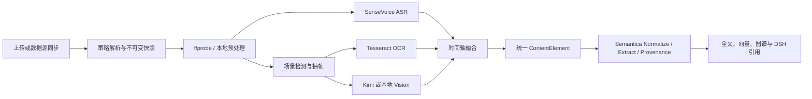

# 多模态音视频架构

## 目标与边界

音视频不是作为附件旁路保存，而是进入与普通文档一致的“版本 → ContentElement → Chunk → Semantica 语义抽取/治理 → OpenSearch、Qdrant、FalkorDB → DSH 问答”链路。新增代码负责媒体编排，不复制 Semantica 的统一元素、溯源、归一化、抽取、治理、图谱和检索算法。

## 组件责任

| 组件 | 输入 | 输出 | 责任 |
|---|---|---|---|
| FastAPI | 文件、数据源配置、策略 ID/单次覆盖 | 版本、任务、媒体 API | 权限、策略优先级、云处理确认、Range 播放、CRUD |
| Celery Worker | 文档版本与不可变策略快照 | 运行、场景、帧、转写、元素 | 真实进度、取消、重试、缓存、失败降级 |
| ffmpeg/ffprobe | 原始媒体 | 标准化音轨、关键帧、元数据 | 本地确定性预处理 |
| ASR Runtime | WAV 分段 | 带时间区间的中文转写 | 独立内网 SenseVoice/FunASR 服务，不保存平台密钥 |
| OCR | 关键帧 | 文本与置信度 | Tesseract `chi_sim+eng` 本地执行 |
| Vision Adapter | 选中关键帧 | 严格 JSON 视觉事实 | Kimi/OpenAI 兼容协议；响应经 Pydantic 拒绝额外字段 |
| MinIO | 原文件、帧、缩略图 | 权限化对象 | 对浏览器不暴露长期公开地址 |
| Semantica | ContentElement | Chunk、实体、事实、溯源 | 原有知识加工核心 |

## 数据模型

- `MediaParsingPolicy/MediaParsingPolicyVersion`：策略 CRUD、默认项、版本与不可变快照。
- `MediaProcessingRun`：输入指纹、阶段、百分比、模型引用、缓存命中、警告和错误。
- `MediaAudioSegment`：开始/结束时间、文本、语言、说话人、置信度和事件。
- `MediaScene`：场景区间、检测方式、融合摘要和证据帧/转写。
- `MediaFrame`：时间点、场景、对象键、缩略图、SHA-256、pHash、OCR、Vision 和云调用审计。
- `ContentElement`：`transcript_segment`、`speaker_turn`、`audio_event`、`keyframe_ocr`、`visual_scene`、`media_chapter`、`media_summary` 等统一元素。

## 一致性与缓存

缓存按媒体 SHA-256、策略功能配置、模型名/地址/参数和提示词版本分阶段计算。连接测试时间、数据库行 ID 和密钥不会进入指纹。重处理按稳定元素 ID 原位更新；消失元素软删除，避免破坏仍被当前 Chunk 引用的外键。仅当媒体阶段真实变化时才重新排队知识加工；完整缓存命中不产生重复知识任务。

## 部署

Compose 比原平台新增 `asr-runtime`，因此标准部署为 13 个核心服务。ASR 只开放 Docker 内网 `8001`；模型权重放在 `asr-model-cache` Volume。API、Worker、Scheduler 和 MCP 使用同一个应用镜像，镜像内包含 ffmpeg、LibreOffice、Tesseract 中英文、libmagic、Docling 和 CPU torchvision。
