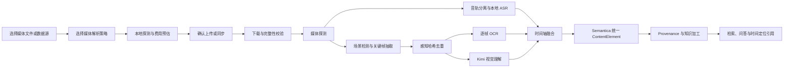

# 传神智库多模态音视频解析流水线详细设计

> 设计基线：`知识底座V1.0` 之后的当前开发基线  
> 开发分支：`codex/multimodal-media-pipeline`  
> 设计日期：2026-09-03  
> 状态：开发前设计冻结版

## 1. 目标与边界

本能力把图片、音频和视频从“可上传的附件”升级为可治理、可检索、可引用、可回放定位的知识。处理结果必须继续进入传神智库现有的文档版本、`ContentElement`、切片、语义抽取、治理、全文索引、向量索引、图谱和 Provenance 链路，不能形成与 Semantica 平行的知识孤岛。

本轮实现：

- 图片 OCR 与云端视觉理解分离。
- 音频本地 ASR，输出带时间戳的转写片段。
- 视频本地探测、音轨分离、可配置抽帧、场景切分、OCR、视觉理解和时间轴元素。
- 媒体解析策略 CRUD、默认策略、版本、复制、校验和使用记录。
- 上传、数据源和知识空间三级策略绑定，并允许单次上传覆盖。
- 处理运行、阶段进度、取消、重试、缓存命中、错误和模型调用可追溯。
- 文档详情播放器、时间轴、转写、场景、关键帧、处理记录和模型结果。
- 检索结果及引用携带时间区间，点击引用定位到播放器。

不修改 DeepSeek Harness 的 Agent Loop；Harness 继续只消费 FastAPI 提供的结构化知识工具结果。媒体定位字段是现有知识工具契约的向后兼容扩展。

## 2. 现状审计与复用边界

| 层级 | 已有能力 | 本轮复用方式 | 本轮补充 |
|---|---|---|---|
| Semantica `MediaParser` | 图片、音频、视频类型识别；图片解析；音视频元数据 | 继续作为 `parse_document` 的原生媒体入口 | 不复制其媒体探测和元数据逻辑 |
| Semantica `ImageParser` | OCR 与图像元数据 | OCR 仍通过现有解析路径或逐帧 OCR 适配器调用 | 增加逐帧结果和可信度元数据 |
| `parse_document` | 统一 `ContentElementData` 与稳定元素 ID | 所有媒体结果最终转换为统一元素 | 增加时间轴元素类型与可追溯字段 |
| Worker | 下载、解析、持久化、Provenance、知识加工 | 延续同一个任务和后续知识加工链 | 增加媒体子阶段、真实阶段进度、取消与重试 |
| ASR 适配器 | OpenAI 兼容转写、视频本地抽音轨 | 保留协议；本地 ASR Runtime 也实现同一协议 | 片段时间戳、VAD/标点参数、运行记录 |
| Vision 适配器 | Kimi/OpenAI 兼容视觉描述、均匀抽帧 | 保留 Kimi 调用与已有安全密钥管理 | 改为对选定关键帧/场景调用，返回严格结构化结果 |
| MinIO | 原文件对象存储 | 原文件不搬迁 | 保存关键帧和缩略图，走受权限保护的 API |
| 检索/DSH | 结构化召回项、引用和事件 | 继续使用现有知识工具 | 增加媒体时间、帧、场景和播放器链接字段 |

现状缺口：只有整段转写、最多 8 个均匀关键帧和一段视觉描述；没有策略快照、场景切分、逐帧 OCR/视觉、时间轴引用、缓存或专用媒体详情。

## 3. 业务流程



用户可在文档详情查看真实处理阶段、转写、场景、关键帧和模型结果；失败阶段可单独重试，取消后保留已安全落盘的可复用中间结果。

## 4. 策略模型与优先级

策略解析顺序固定为：

1. 本次上传/同步的单次覆盖；
2. 数据源绑定策略；
3. 知识空间默认策略；
4. 租户系统默认策略。

任务创建时将解析后的完整配置、策略版本号和配置哈希写入 `DocumentVersion.media_policy_snapshot` 和 `MediaProcessingRun.policy_snapshot`。后续修改策略不会悄悄改变历史版本的重试行为。

### 4.1 核心配置

| 配置组 | 字段 | 校验 |
|---|---|---|
| 通用 | 适用图片/音频/视频、处理模式 `local/cloud/hybrid`、最大时长、失败降级 | 云端模式必须明确启用云处理 |
| 抽帧 | `fixed_interval/fixed_fps/scene/smart` | 四选一 |
| 固定间隔 | 秒数 | 0.5–600 秒 |
| 固定 FPS | FPS | 0.01–2 |
| 场景 | 阈值、最短场景、场景首/中/尾选帧 | 阈值 0.01–0.99 |
| 智能混合 | 最大间隔、场景阈值、首尾保留 | 同时满足时间覆盖和场景变化 |
| 保护 | 最大帧数、最大图片边长、单帧字节数、超限动作 | 超限可截断或失败，不能无限处理 |
| 去重 | 感知哈希阈值 | 0–64；记录被哪个帧去重 |
| OCR | 是否启用、语言、置信度阈值 | OCR 与视觉独立开关 |
| ASR | 是否启用、模型配置、语言、VAD、标点、分段上限 | 未配置时明确降级 |
| Vision | 是否启用、模型配置、批大小、超时、提示模板版本 | 云端发送前需策略允许 |
| 缓存 | 是否启用、缓存有效范围 | 输入哈希、策略哈希和模型指纹共同决定 |

### 4.2 抽帧预计数量

- 固定间隔：`floor(duration / interval) + 首尾帧`，去重后不超过 `max_frames`。
- 固定 FPS：`ceil(duration * fps)`，不超过 `max_frames`。
- 场景模式：探测前给出上界预估；探测后更新为真实场景数和选帧数。
- 智能混合：场景候选与最大时间间隔候选合并、排序、感知哈希去重。

上传弹窗展示预计帧数、可能调用云端的帧数和上限提醒。预估不是进度，不以伪造值替代实际探测。

## 5. 数据模型

| 模型 | 责任 | 关键约束 |
|---|---|---|
| `MediaParsingPolicy` | 策略身份、当前版本、启停、默认 | 租户内名称唯一；每租户最多一个有效默认 |
| `MediaParsingPolicyVersion` | 不可变策略快照 | `(policy_id, version_number)` 唯一，保存 config hash |
| `MediaProcessingRun` | 一次媒体运行 | 关联文档版本、策略版本、模型、阶段、进度、缓存和错误 |
| `MediaAudioSegment` | ASR 片段 | 片段序号唯一；`start < end`；保存语言/说话人/置信度 |
| `MediaScene` | 视频场景 | 场景序号唯一；保存边界、摘要及证据关联 |
| `MediaFrame` | 关键帧与处理结果 | 时间戳、MinIO 对象、缩略图、哈希、选帧原因、OCR/Vision 状态 |
| `DocumentVersion` 扩展 | 历史解析语义 | 保存策略版本 ID 和解析后完整策略快照 |
| `KnowledgeSpace` 扩展 | 空间默认策略 | 可空，回退到系统默认 |

时间轴不另建一份与知识元素平行的文本模型：以专用运行表保存处理事实，以现有 `ContentElement` 保存可检索知识。两者通过 `run_id/segment_id/scene_id/frame_id` 关联。

新增元素类型：

- `transcript_segment`
- `speaker_turn`
- `audio_event`
- `keyframe_ocr`
- `visual_scene`
- `media_chapter`
- `media_summary`

每个时间元素至少保留 `media_type`、`time_start`、`time_end`、`run_id`、模型/解析器标识和输入证据 ID。不得把密钥、完整请求报文或系统提示写入元数据。

## 6. 处理流水线与真实进度

| 阶段 | 进度区间 | 完成条件 |
|---|---:|---|
| 下载 | 0–8% | 原对象下载完成并校验大小/哈希 |
| 媒体探测 | 8–14% | ffprobe 和 Semantica 元数据完成 |
| 音轨预处理 | 14–20% | 音轨抽取、采样率转换完成 |
| ASR | 20–45% | 按已完成音频区间/总时长计算 |
| 场景检测 | 20–30% | 场景边界探测完成；与 ASR 可并行时按权重合并 |
| 抽帧与去重 | 30–48% | 按已处理候选帧/总候选帧计算 |
| OCR | 48–62% | 按已处理帧数计算 |
| Vision | 62–78% | 按已完成批次/总批次计算 |
| 时间轴融合 | 78–84% | 场景、转写、OCR 与视觉结果关联完成 |
| ContentElement 持久化 | 84–90% | 数据库事务提交完成 |
| Provenance | 90–94% | Semantica Provenance 写入完成 |
| 知识加工 | 94–100% | 后续切片、抽取、治理和索引发布完成 |

每阶段由真实工作量更新，不使用定时器自动增长。长时间外部调用显示该阶段名称、已完成批次、耗时和最近心跳，不伪造百分比。任务取消在阶段边界和批次边界检查；ffmpeg 子进程收到终止信号；HTTP 调用使用有限超时。

## 7. 本地 ASR Runtime

ASR 作为独立 Docker 内网服务，不装入 API/Worker 进程。对外提供 OpenAI 兼容 `/v1/audio/transcriptions` 与 `/health`：

- 首选 SenseVoiceSmall + FunASR，CPU 推理，模型目录挂载到独立缓存卷。
- 当 SenseVoice 在目标平台不可用时，可显式选择 faster-whisper `small` 作为后备配置；不会把降级伪装为 SenseVoice。
- 返回文本、语言、片段开始/结束、置信度；支持 VAD、标点和热词配置。
- 仅开放 Docker 内网，不保存平台 API Key。
- 健康检查区分服务可达、模型已加载和模型预热完成。

模型配置仍由传神智库 `ModelConfig(kind=asr)` 管理，连接测试必须提交真实短音频。

## 8. Kimi K3 视觉适配

Kimi 视觉模型继续通过已有加密模型配置读取凭据。若视觉配置复用默认 Kimi LLM 的凭据，数据库只保存 `credential_model_config_id` 引用，不复制密钥明文。

调用单位是图片或选定关键帧，不直接上传完整视频。请求结果使用严格结构化模式并在服务端校验：

```json
{
  "summary": "可见内容概述",
  "visible_text": ["画面文字"],
  "objects": [{"name": "对象", "attributes": {}}],
  "actions": ["可见动作"],
  "relations": [{"subject": "A", "predicate": "关系", "object": "B"}],
  "uncertainties": ["无法确认的信息"]
}
```

模型输出只描述可见证据；文档中的提示注入文本作为不可信内容处理。模型、配置版本、耗时、状态和 token 统计可记录，凭据和完整内部提示不可记录。

## 9. 缓存与增量

阶段缓存键：

`SHA256(source_sha256 + stage + policy_section_hash + model_fingerprint + adapter_version)`

- 媒体探测只依赖文件哈希和适配器版本。
- 抽帧依赖文件哈希和抽帧策略哈希。
- OCR 依赖帧哈希、OCR 语言和引擎版本。
- ASR 依赖音轨哈希、ASR 模型指纹及 VAD/语言配置。
- Vision 依赖帧哈希、视觉模型指纹和提示模板版本。
- 重新运行只复用完全相同的成功结果；失败、取消或配置变化不误命中。

运行记录明确显示 `cache_hit`、来源运行和复用的阶段。新文档版本仍遵守现有文档 SHA-256 去重与 Chunk 级增量发布。

## 10. API 设计

新增资源遵循现有 `/api/v1`、租户和知识空间权限模型：

- `GET/POST /media-policies`
- `GET/PUT/DELETE /media-policies/{id}`
- `POST /media-policies/{id}/clone`
- `GET /media-policies/{id}/versions`
- `GET /media-policies/{id}/usage`
- `POST /media/probe`
- `POST /media/estimate-frames`
- `GET /documents/{id}/media-profile`
- `GET /documents/{id}/timeline`
- `GET /documents/{id}/scenes`
- `GET /documents/{id}/frames`
- `GET /documents/{id}/transcript`
- `GET /documents/{id}/processing-runs`
- `GET /media/frames/{id}/thumbnail`
- `GET /media/frames/{id}/content`
- `POST /media/runs/{id}/cancel`
- `POST /media/runs/{id}/retry`

上传接口增加可选 `media_policy_id` 与 `media_policy_override`，保持旧调用兼容。数据源配置增加 `media_policy_id/media_policy_override`，仅对可能产生媒体文件的数据源显示。

媒体内容和缩略图 API 先检查租户和知识空间权限，再使用 MinIO 读取；不返回可长期共享的公开对象地址。

## 11. UI/UX

### 11.1 配置中心

新增“媒体解析策略”，列表展示名称、适用类型、抽帧模式、ASR、OCR、Vision、默认状态和使用数。支持新增、编辑、复制、启停、设为默认、查看版本、查看使用和删除；被使用策略采用软删除并保留历史版本。

### 11.2 上传与数据源

选择图片/音频/视频后才展示紧凑媒体设置：策略、处理模式、抽帧方式、关键参数、预估帧数和云端提示。默认使用继承策略，用户可展开单次覆盖。取消弹窗不触发表单校验或上传。

媒体型数据源的创建/编辑页展示策略绑定；同步创建文档版本时解析为不可变策略快照。

### 11.3 文档详情

媒体文档显示播放器和六个页签：时间轴、转写、场景、关键帧、处理记录、模型结果。播放器时间与时间轴高亮联动；点击转写/场景/关键帧跳转对应时间。运行中的页面展示真实阶段和进度，失败显示可操作原因、重试和降级结果。

### 11.4 检索与问答

召回卡片和引用增加 `mm:ss–mm:ss` 或 `hh:mm:ss`，展示转写/场景/OCR/视觉来源。点击引用打开文档媒体详情并定位时间。回答不可引用未获权限的媒体片段。

## 12. 安全与合规

- 文件扩展名、MIME 和 Magic Bytes 继续交叉验证。
- ffmpeg/ffprobe 使用参数数组，禁止 shell 拼接。
- 所有子进程有超时、资源限制和受控临时目录。
- MinIO 对象键由服务端生成，文件名仅取 `Path.name`。
- 云端视觉必须有策略级显式许可；前端提示哪些帧会发往云端。
- 音视频内容、OCR 文本和视觉描述均视为不可信数据，不能覆盖系统/Agent 指令。
- 日志、运行记录和错误消息统一脱敏，不保存密钥或数据 URL。
- 删除策略与运行采用软删除；删除文档时继续走现有权限和对象清理规则。

## 13. 测试与验收矩阵

| 层级 | 必测内容 |
|---|---|
| 单元 | 四种抽帧计划、边界校验、策略优先级/快照、感知哈希、时间格式、元素稳定 ID、缓存指纹、取消、结构化 Vision 校验、Secret 脱敏 |
| Semantica 合约 | MediaParser 元数据、ImageParser OCR、`parse_document` 媒体元素、Provenance、切片与检索字段 |
| 模型合约 | 本地 ASR 真实短音频；Kimi K3 真实图片；未配置/超时/429/非法输出降级 |
| API E2E | 策略全 CRUD、上传/探测/预估、运行、时间轴、帧访问、取消/重试、权限隔离 |
| Docker | API、Worker、Scheduler、MinIO、ASR Runtime 及现有中间件健康 |
| 浏览器 | 上传配置、预估、进度、播放器、各页签、引用定位、弹窗取消、响应式和 Console |
| 回归 | 既有非媒体格式、数据源、治理、检索、图谱、DSH 对话不能退化 |

真实 fixture 至少包含：带中文语音和停顿的 WAV/MP3、包含转场/字幕/表格/产品画面的 MP4、PNG/JPEG。测试事实必须可人工核验，报告区分真实模型验证、协议级验证和未执行项。

## 14. 迁移、兼容和回滚

- 新增 `0019_multimodal_media.sql`，只增表、索引和可空列。
- 旧文档版本的媒体策略字段为空时使用旧解析摘要展示，不强制重跑。
- 旧上传接口无需传媒体字段。
- 策略历史、处理运行和元素元数据可追溯；发布失败不替换当前有效知识版本。
- 应用回滚时新表保留，不删除 Volume；旧代码忽略新增列和表。

## 15. 开发顺序

1. 数据模型、迁移、策略校验和快照解析。
2. 策略 CRUD、探测/预估和上传/数据源绑定。
3. 本地媒体处理器、场景/抽帧/去重/OCR、时间轴元素。
4. 本地 ASR Runtime 和 Kimi 结构化 Vision。
5. Worker 阶段进度、取消、重试和缓存。
6. 媒体详情、播放器、策略 UI 和上传 UI。
7. 检索/引用字段扩展及播放器定位。
8. 单元、合约、E2E、Docker、浏览器与三轮回归。
9. 文档、测试报告、提交和推送。

## 16. 完成判定

只有真实媒体在 Docker 中完整处理，时间轴元素可检索、引用可定位，策略历史和运行过程可追溯，本地 ASR 与 Kimi Vision 都通过真实最小请求，自动化与浏览器回归通过，且无 Secret 泄露、假进度或假结果，才可宣布完成。
