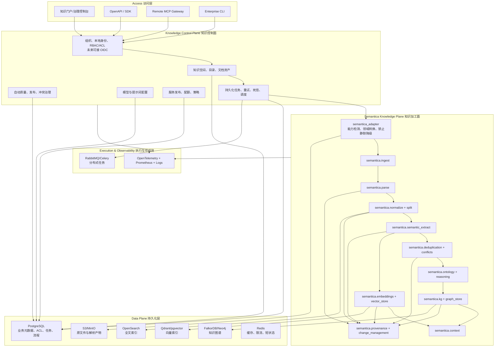
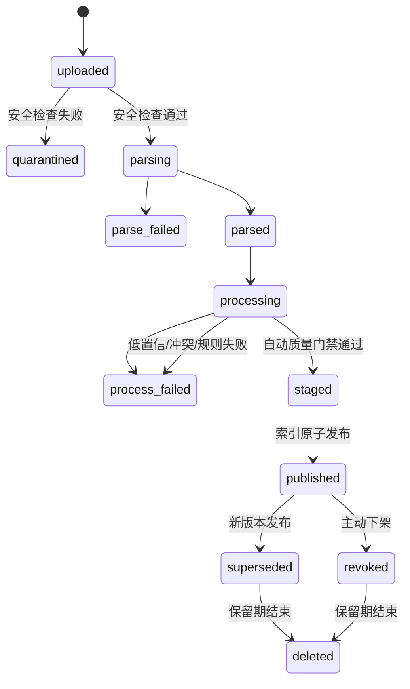
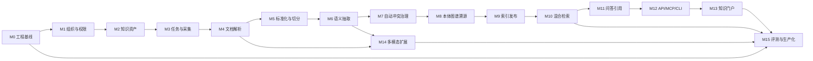

# 国联集团组织级知识平台——基于 Semantica 的二开详细设计

> 设计基线：Semantica `0.6.6`，源码提交 `cce5ea177cba`  
> 设计目标：不依赖现有 RAG 知识库，从零建设一套满足集团组织级要求的知识平台，Semantica 作为语义处理和知识智能核心。  
> 文档状态：产品与技术总体设计 v0.2；已按业务确认回溯，M0–M4 已开发并部署验证。

### 已确认的业务边界（2026-08-29）

| 事项 | 当前决策 | 设计影响 |
|---|---|---|
| 组织结构 | 支持集团、子企业、部门及更多任意层级 | OrgUnit 使用通用父子树，不固化三级结构；组织授权向下继承，显式 Deny 优先。 |
| 密级 | 暂不建设 | 页面不出现密级字段；当前只做空间/组织/角色/用户 ACL。底层保留默认内部标记仅用于未来兼容，不参与业务判定。 |
| 审核审批 | 不需要 | 不建设人工审核、审批工单和待办；质量规则自动执行，失败进入可重试任务，变更依靠版本和回滚治理。 |
| 统一身份 | 暂无统一身份地址 | M0–M4 采用本地账号、Scrypt 密码和 JWT；保留身份适配边界，未来有 OIDC 地址时平滑切换。 |
| 默认大模型 | Kimi K3 | 使用 Moonshot OpenAI 兼容接口；API Key 以 Docker Secret 注入、数据库加密存储，页面只显示配置状态。 |

## 1. 总体结论与建设边界

本产品不是对 Semantica Explorer 进行界面改造，而是建设一个新的“组织级知识平台”，并把 Semantica 作为核心语义引擎。

产品分为两个核心平面：

1. **集团知识控制面**：负责组织、本地身份、权限、知识空间、目录、任务、版本、自动质量规则、发布、运维和审计。这些能力在 Semantica 中不完整，由本项目新建。
2. **Semantica 知识加工面**：负责采集适配、文档解析、标准化、切分、实体/关系/事件抽取、去重、冲突、本体、知识图谱、推理、向量、溯源、版本和导出。原则上不重复开发。

### 1.1 必须坚持的工程原则

| 原则 | 设计要求 |
|---|---|
| Semantica 优先 | 开发解析、抽取、去重、图谱、本体、推理或溯源能力前，先确认 Semantica 对应包是否已有实现。 |
| 适配层隔离 | 业务模块不直接依赖 Semantica 内部对象，统一通过 `semantica_adapter` 转换为平台领域对象。 |
| 不使用隐式降级 | 生产环境禁止随机向量、Hash 向量、默认英文模型、占位 Parser 等静默降级。能力不存在时必须显式失败。 |
| 原文不可变 | 原文件和已发布版本不就地修改；解析、Chunk、实体、图谱和索引都是可重建的派生物。 |
| 权限前置 | 权限过滤发生在全文召回、向量召回和图扩展之前，不允许生成答案后再过滤。 |
| 先证据后发布 | 模型抽取的知识先进入 staging，通过自动校验和置信度策略后发布；不引入人工审批流程。 |
| 全链路溯源 | 回答、推理事实和图谱边必须可回到文档版本、页码/单元格/时间码和处理运行。 |
| 单模块验收 | 每个模块同时交付代码、接口、测试、金标数据、指标和可演示样例，不通过验收不进入下一模块。 |

### 1.2 Semantica 依赖管理策略

- 在集团代码库保留 Semantica Fork，锁定 commit，不使用浮动版本。
- 建立 `UPSTREAM_PATCHES.md`，记录每一个对 Semantica 源码的修改、原因、测试和上游同步状态。
- 通用修复尽量保持为独立提交；集团业务逻辑不写入 Semantica 包内。
- 平台只使用已验证的公开入口或明确锁定的子模块入口。
- 每次升级必须运行 Semantica 适配层 contract test。

## 2. 产品定位与用户

平台是集团统一的知识基础设施，以“知识空间”为业务边界，向人、业务系统、模型和 Agent 提供同一套可治理、可授权、可溯源、可版本化的知识。

| 角色 | 核心职责 |
|---|---|
| 集团平台管理员 | 管理租户、组织同步、全局策略、模型、配额、服务发布和运行状态。 |
| 子企业管理员 | 管理本企业知识空间、成员、数据源和使用配额。 |
| 知识负责人 | 管理目录、标签、质量阈值、发布和下架。 |
| 领域专家 | 维护词表、规则、本体与质量基线，不承担逐条审批。 |
| 知识生产者 | 上传、维护、标注文档和处理失败样本。 |
| 知识消费者 | 搜索、问答、查看引用和提交反馈。 |
| 应用/Agent 开发者 | 申请 API/MCP/CLI 凭据，绑定知识空间和权限范围。 |
| 审计员 | 查看访问、变更、模型、推理、发布和导出记录。 |

## 3. 总体架构



### 3.1 可部署服务

| 服务 | 主要职责 | Semantica 关系 |
|---|---|---|
| `knowledge-api` | 业务 API、身份校验、知识资产、治理、搜索和问答统一入口 | 通过 Adapter 调用检索和溯源能力 |
| `knowledge-worker` | 采集、解析、切分、抽取、构图、建索引和重建 | 调用经验证的 Semantica handlers，不使用空 worker 骨架 |
| `retrieval-service` | 权限编译、全文+向量+图谱召回、融合、精排和上下文打包 | 复用 `ContextRetriever`、`HybridSearch` 和图扩展算法，外围增加 ACL |
| `answer-service` | 查询理解、基于证据生成、引用、拒答和反馈 | 复用 `query_with_reasoning` 思路、LLM provider 和 explanation |
| `mcp-gateway` | 远程 MCP、Service Account、空间授权、限流和审计 | 复用 Semantica MCP 工具逻辑，不复用仅 stdio 的运行时 |
| `knowledge-web` | 门户、资产、自动质量、本体、图谱、运维和审计界面 | 复用 Explorer 交互概念和 visualization，不复用内存 `app.state` |

开发阶段可将 API、Retrieval、Answer 合并为一个模块化单体，Worker 保持独立进程。生产阶段根据容量指标再拆分，避免过早微服务化。

## 4. Semantica 复用清单

复用级别：

- **R0 直接复用**：不改核心逻辑，只通过 Adapter 转换输入输出。
- **R1 包装复用**：复用主要实现，增加权限、持久化、幂等、超时、指标或自动质量门禁。
- **R2 插件扩展**：保留 Semantica 协调模型，新增中文、多模态、组织规则或后端插件。
- **N 新建**：Semantica 没有产品级实现，由平台建设。

| 产品能力 | Semantica 源码模块 | 级别 | 二开动作 |
|---|---|---:|---|
| 文件、网页、API、数据库、邮件、代码库采集 | `semantica.ingest` | R1 | 包装为 SourceConnector，增加凭据托管、增量游标和幂等任务 |
| PDF/DOCX/PPTX/XLSX/HTML/JSON/XML/CSV/图片解析 | `semantica.parse` | R0/R1 | 直接复用 Parser，统一转换为 ContentElement |
| Docling 布局与 OCR | `DoclingParser` | R1 | 强制能力检测，补充中文 OCR 策略和质量指标 |
| 文本、实体、日期、数值、编码标准化 | `semantica.normalize` | R0 | 配置化调用，不重写 |
| 结构、表格、语义、实体感知和层次切分 | `semantica.split` | R0/R1 | 复用 TextSplitter/TableChunker，增加稳定 ID 和权限字段 |
| 实体、关系、三元组、事件、指代抽取 | `semantica.semantic_extract` | R1/R2 | 复用调度、数据类型和验证，注入中文/大模型 provider |
| 重复检测、实体合并 | `semantica.deduplication` | R1 | 增加领域阈值、锁定实体、自动决策记录和可撤销性 |
| 冲突检测、来源、处理建议 | `semantica.conflicts` | R1 | manual/expert review 结果仅作为自动策略信号，不生成人工待办 |
| 知识图谱构建、校验、时态和图算法 | `semantica.kg` | R1 | 使用持久图库，增加 tenant/space/ACL/version 字段 |
| 属性图持久化 | `semantica.graph_store` | R1 | 开发阶段 FalkorDB，生产在 M8 性能门禁选型 |
| 本体、OWL、SKOS、SHACL、对齐和版本 | `semantica.ontology` | R1 | 保留算法，把 Explorer 内存草稿/提案改为 PostgreSQL 流程 |
| 规则推理和解释 | `semantica.reasoning` | R1 | 只对已发布知识运行，推理事实单独标识 |
| 文本 Embedding | `semantica.embeddings` | R1/R2 | 注入中文/多语模型，固化 model/version/dimension/metric |
| 向量存储与融合 | `semantica.vector_store` | R1 | 使用 Qdrant/pgvector，每条 payload 带权限和版本 |
| GraphRAG/多跳上下文 | `semantica.context.ContextRetriever` | R1 | 复用图扩展和推理，重写调用边界以强制 ACL |
| 溯源、校验和完整性链 | `semantica.provenance` | R1 | 增加业务主体、租户、模型和任务字段 |
| 快照、版本比较、Delta | `semantica.change_management` | R1 | 绑定 DocumentVersion 和 IndexRelease，不只使用本地 SQLite |
| 多格式导出与报告 | `semantica.export` | R0/R1 | 直接复用，外围增加授权、脱敏和导出任务 |
| 图谱、本体、向量和时态可视化 | `semantica.visualization` | R0/R1 | 复用生成能力，数据由授权服务端提供 |
| 插件发现与生命周期 | `PluginRegistry` | R1 | 仅在受信进程内使用，外加白名单、版本和能力清单 |
| Pipeline DAG 与执行 | `semantica.pipeline` | R1 | 复用 PipelineBuilder/handler；任务领取、持久化、重试由平台实现 |
| 组织、租户、用户、RBAC/ACL | 无产品级实现 | N | 新建本地身份、组织继承和策略引擎 |
| 知识资产目录与空间 | 无 | N | 新建领域模型、API 和控制台 |
| 持久化任务与自动处理流程 | worker/Explorer 仅骨架或内存态 | N | 新建任务表、队列 worker、自动状态机和可重试/回滚机制 |
| 远程 MCP 网关 | 安装入口只有 stdio | N/R1 | 保留工具 schema/实现意图，新建认证的 Streamable HTTP 服务 |
| 知识质量与 RAG 评测 | `semantica.evals` 未实现 | N | 新建金标集、离线评测、在线反馈和回归门禁 |
| 音频 ASR、说话人分离、视频语义 | MediaParser 只有元数据 | R2/N | 新建 MultimodalEnricher，输出仍转为统一 ContentElement |

## 5. 统一领域模型

### 5.1 知识数据分层

| 层级 | 对象 | 说明 | 持久化 |
|---|---|---|---|
| L0 原始层 | `Blob` / `SourceSnapshot` | 原文件、外部记录快照、媒体文件 | Object Store + PostgreSQL metadata |
| L1 资产层 | `Document` / `DocumentVersion` | 稳定文档身份和不可变版本 | PostgreSQL |
| L2 解析层 | `ParseArtifact` / `ContentElement` | 页、段落、标题、表格、图片、幻灯片、音视频片段 | Object Store + PostgreSQL index |
| L3 片段层 | `Chunk` | 可检索的稳定片段，保留结构和原文位置 | PostgreSQL + OpenSearch |
| L4 语义层 | `EntityMention` / `RelationAssertion` / `EventAssertion` | 模型从某个 Chunk 抽取的候选知识 | PostgreSQL staging + provenance |
| L5 规范知识层 | `CanonicalEntity` / `Fact` / `OntologyTerm` | 去重、冲突处理和自动质量门禁后的已发布知识 | Graph Store + PostgreSQL mapping |
| L6 索引层 | `VectorRecord` / `SearchRecord` / `IndexRelease` | 根据某一发布版本生成的可重建索引 | Qdrant/OpenSearch |
| L7 服务层 | `QueryRun` / `AnswerRun` / `Citation` | 查询、召回、推理、答案、引用和反馈 | PostgreSQL + Audit Store |

### 5.2 所有知识对象的必备字段

| 字段 | 用途 |
|---|---|
| `tenant_id` / `space_id` | 租户和知识空间边界 |
| `object_id` / `object_version` | 稳定 ID 和业务版本 |
| `source_id` / `document_id` / `document_version_id` | 原始来源绑定 |
| `scope_tokens` / `policy_version` | 检索前的组织/角色/用户 ACL 过滤；当前无密级字段 |
| `valid_from` / `valid_to` | 事实在业务世界的有效时间 |
| `system_from` / `system_to` | 平台得知和替换该事实的时间 |
| `provenance_id` / `run_id` | 血缘和处理运行 |
| `model_id` / `model_version` | 模型类操作的可重现信息 |
| `status` | draft/staging/published/revoked/deleted/failed；当前不设 review 状态 |
| `created_by` / `created_at` | 责任主体与时间 |

### 5.3 核心实体

| 领域 | 实体 |
|---|---|
| 组织与权限 | Tenant、OrgUnit、Subject、Group、Role、RoleBinding、Policy、AccessGrant |
| 知识组织 | KnowledgeSpace、Collection、Tag、KnowledgeOwner、RetentionPolicy |
| 数据源与资产 | SourceConnector、SourceCursor、Document、DocumentVersion、Blob、ContentElement、Chunk |
| 语义治理 | ExtractionRun、EntityMention、CanonicalEntity、RelationAssertion、Fact、ConflictCase、MergeCase、AutoDecisionRecord |
| 本体与词表 | Ontology、OntologyVersion、OntologyTerm、Alignment、Shape、ValidationReport |
| 索引与发布 | IndexBuild、IndexRelease、Publication、Tombstone |
| 任务与运行 | Job、JobStep、TaskAttempt、DeadLetter、CapabilityReport |
| 服务与审计 | ServiceAccount、ApiCredential、QueryRun、AnswerRun、Citation、Feedback、AuditEvent |

### 5.4 稳定 ID 规则

- `document_id`：业务稳定标识，同一文档更新不改变。
- `document_version_id`：`document_id + source_version/content_sha256`。
- `element_id`：`document_version_id + element_type + structural_path + ordinal`。
- `chunk_id`：`document_version_id + splitter_version + structural_path + content_hash`。
- `mention_id`：`chunk_id + extractor_version + span + type`。
- `canonical_entity_id`：独立于任何单一文档；合并/拆分使用 redirect 和 lineage 保留历史。
- 所有 ID 算法包含 `schema_version`。

## 6. 权限与组织设计

### 6.1 权限模型

当前采用 **RBAC + 组织继承 + 资源 ACL**：

- RBAC 决定用户能否管理空间、上传、发布、查询、导出或调用 Agent 服务。
- 组织树支持任意深度；授予上级组织的权限可被下级成员继承。
- 资源 ACL 用于 KnowledgeSpace、Collection、Document 的个别授权或拒绝。
- 显式 Deny 高于 Allow。当前不做密级和密级传播。

### 6.2 权限传播

```text
KnowledgeSpace / Collection / DocumentVersion
    ↓ 继承 space_id + scope_tokens + policy_version
ContentElement
    ↓
Chunk / SearchRecord / VectorRecord
    ↓
EntityMention / Fact / CanonicalEntity / Relation
    ↓
Graph seed / Graph expansion path / Reasoning fact
    ↓
Context item / Citation / Answer
```

多源合并实体默认采用保守策略：

- 实体层不把多来源权限合并为宽权限。
- 召回时以可见的 assertion/source 展开，不暴露不可见来源的属性。
- 图扩展的每个节点和边都必须通过 `AuthorizationContext`。
- 问答引用只能包含当前主体可读的 SourceFragment。

### 6.3 后端过滤编译

| 后端 | 权限实现 |
|---|---|
| PostgreSQL | 所有业务查询强制 `tenant_id`；可用 Row Level Security 作为防御层 |
| OpenSearch | bool filter 强制 tenant/space/status/scope token |
| Qdrant | payload filter 强制 tenant/space/index_release/scope token |
| Graph Store | 每个 seed 和 traversal 查询带 tenant/space/status/scope token |
| Cache | key 包含 tenant、subject/scopes hash、policy version、index release |

## 7. 知识生命周期与主流程

### 7.1 DocumentVersion 状态机



### 7.2 采集和发布流程

1. 连接器创建 SourceSnapshot，写入内容指纹、源版本和游标。
2. 原内容写入 Object Store，创建不可变 DocumentVersion。
3. 安全检查后，Worker 调用 Semantica Parser 生成 ContentElement。
4. 调用 Normalize/Split，生成带结构位置的 Chunk。
5. 调用 Semantic Extract，生成 mention/assertion/event。
6. 调用 Deduplication/Conflicts/EntityResolver，按版本化策略自动合并或保留冲突候选。
7. 调用 Ontology/SHACL/GraphValidator 做语义质量门禁。
8. 建设 staging 全文、向量和图谱版本。
9. 自动发布策略通过后产生 IndexRelease，原子切换可见版本。
10. 记录 Semantica provenance 与平台 AuditEvent。

### 7.3 查询和问答流程

1. 网关验证用户或 Service Account，得到 AuthorizationContext。
2. 权限引擎把上下文编译为 OpenSearch/Qdrant/Graph 三种过滤条件。
3. 查询分析生成关键词、语义查询、实体候选和图谱种子。
4. 并行执行 BM25、向量和图谱召回。
5. 使用 RRF/加权融合，再使用中文 reranker 精排。
6. 去重并生成可追溯 ContextBundle，每条结果都有 SourceFragment。
7. 问答服务仅使用该 ContextBundle 生成答案；证据不足时拒答。
8. 对答案 claim 进行引用映射，过滤无证据 claim。
9. 保存 QueryRun、召回列表、模型/提示词版本、答案、引用和耗时。

### 7.4 更新和删除流程

- **更新**：创建新 DocumentVersion，使用内容指纹和 Semantica delta 计算变更，只重建受影响的派生知识。
- **发布**：新索引先 staging，校验通过后切换 release alias，旧版本变为 superseded。
- **下架**：写入 Tombstone，立即从可见召回范围排除，异步删除派生索引。
- **物理删除**：受保留策略、诉讼保全和审计要求控制，不与业务下架混同。
- **一致性校验**：后台 reconciliation job 比较 PostgreSQL、OpenSearch、Vector Store 和 Graph Store 的 release/count/checksum。

## 8. 插件与适配层设计

### 8.1 平台插件合约

| 插件类型 | 标准输入 | 标准输出 | Semantica 实现 |
|---|---|---|---|
| SourceConnector | SourceConfig、SourceCursor | SourceItem[]、next cursor | `semantica.ingest` |
| DocumentParser | BlobRef、ParsePolicy | ParseArtifact、ContentElement[] | `semantica.parse` |
| Normalizer | ContentElement | normalized element | `semantica.normalize` |
| ChunkStrategy | ContentElement[]、ChunkPolicy | Chunk[] | `semantica.split` |
| SemanticExtractor | Chunk[]、ExtractionPolicy | mentions/assertions/events | `semantica.semantic_extract` |
| EntityResolutionPolicy | mentions + candidates | merge candidates/decisions | deduplication + KG EntityResolver |
| ConflictPolicy | assertions/sources | ConflictCase[] | `semantica.conflicts` |
| OntologyProvider | entities/relations/domain seed | ontology/shapes/report | `semantica.ontology` |
| ReasoningProvider | published facts/rules | inferred facts/explanations | `semantica.reasoning` |
| EmbeddingProvider | Chunk[]/Entity[] | VectorRecord[] | `semantica.embeddings` |
| GraphBackend | entities/facts | mutations/query result | `semantica.graph_store` |
| VectorBackend | vectors/query/filter | IDs/scores/payload | `semantica.vector_store` |
| ProvenanceProvider | processing event | lineage/checksum | `semantica.provenance` |
| MultimodalEnricher | image/audio/video element | transcript/caption/keyframe/elements | 新建，输出回到统一元素模型 |
| Reranker | query + candidates | reordered candidates | 新建中文 provider |
| AuthorizationCompiler | SubjectContext + scope | backend filters | 新建 |

### 8.2 `semantica_adapter` 子模块

```text
semantica_adapter/
├── capability.py       # 依赖、模型、后端和系统程序检测
├── contracts.py        # 平台 Pydantic 输入输出合约
├── errors.py           # Semantica 异常到平台错误码映射
├── ingest.py           # semantica.ingest wrappers
├── parse.py            # parser 路由与 ContentElement 转换
├── normalize.py        # normalize/split wrappers
├── extract.py          # 中文模型注入、验证、批处理
├── governance.py       # dedup/conflicts/entity resolution
├── ontology.py         # ontology/SHACL/reasoning
├── graph.py            # GraphBuilder/GraphValidator/GraphStore
├── embedding.py        # 生产模型、维度和降级约束
├── retrieval.py        # ContextRetriever 受权包装
├── provenance.py       # 溯源和业务 ID 绑定
└── pipeline.py         # 显式 handlers 和结果转换
```

### 8.3 生产安全包装规则

- 启动时生成 CapabilityReport，确认 Docling、OCR、中文模型、图库、向量库和 SHACL 真正可用。
- 不调用 Semantica 默认“一键构建”和 stub `/build`，必须使用有明确 handler 的 PipelineBuilder。
- 向量结果必须检查 model ID、dimension、normalization 和运行状态。
- Parser 返回占位类、空文本或异常低内容覆盖率时显式失败，不进入索引。
- Semantica 返回对象持久化前必须经过平台 schema validation。

## 9. 逐模块开发与验证路线

下列模块按依赖顺序开发。除明确说明可并行外，前一模块未通过验收时不进入后一模块。

### M0：工程基线与 Semantica 适配层

| 项目 | 内容 |
|---|---|
| 目标 | 建立可重现环境、领域合约、Semantica 能力检测和最小端到端骨架。 |
| 输入 | Semantica Fork、锁定的 Python/系统依赖、一个中文 PDF 样本。 |
| 输出 | 项目骨架、Docker Compose、`semantica_adapter`、CapabilityReport、统一错误码和 contract tests。 |
| Semantica 复用 | Config、PluginRegistry、parser/normalizer/split/extractor 的真实 API。 |
| 新建 | 平台包结构、配置系统、适配层、能力门禁、测试夹具。 |
| 验收 | 新环境一条命令启动；报告列出真实可用/不可用能力；缺少模型时显式失败；中文 PDF 得到可校验 ContentElement。 |

### M1：组织、知识空间与权限核心

| 项目 | 内容 |
|---|---|
| 目标 | 建立一切后续数据的组织和安全边界。 |
| 输入 | Tenant/OrgUnit/Subject、本地账号、空间和授权请求。 |
| 输出 | AuthorizationContext、权限决策、scope_tokens、审计事件。 |
| Semantica 复用 | 不复用其内存 Namespace 权限；只定义向后续 Semantica 对象传递的 metadata。 |
| 新建 | 本地账号与 JWT、任意层级组织树、RBAC/ACL、Policy version、权限编译器；预留 OIDC adapter。 |
| 验收 | 跨 tenant 全部拒绝；授权继承、撤销和 deny 优先正确；同一主体在不同空间得到不同权限。 |

### M2：知识资产、目录与版本

| 项目 | 内容 |
|---|---|
| 目标 | 建立文档从原文到版本、负责人和保留策略的资产管理。 |
| 输入 | 文件/外部 source item、目录、标签和负责人。 |
| 输出 | Blob、Document、DocumentVersion、内容指纹、版本比较和资产 API。 |
| Semantica 复用 | `change_management` 的 snapshot/diff/checksum，`provenance` 的 source 绑定。 |
| 新建 | PostgreSQL 资产模型、Object Store、上传和版本状态机。 |
| 验收 | 重复上传幂等；内容改变产生新版本；原文不可变；版本可比较和追溯。 |

### M3：持久化任务与采集连接器

| 项目 | 内容 |
|---|---|
| 目标 | 将外部源稳定、可恢复地转换为 DocumentVersion。 |
| 输入 | SourceConfig、凭据引用、游标、调度策略。 |
| 输出 | SourceItem、SourceCursor、Job/JobStep/Attempt、DeadLetter、DocumentVersion。 |
| Semantica 复用 | `semantica.ingest`、PipelineBuilder 和 ExecutionEngine 的步骤/handler 模式。 |
| 新建 | Queue worker、claim/lease、幂等键、retry/backoff、DLQ、cancel/resume、定时调度。 |
| 验收 | Worker 崩溃后任务可恢复；同一 cursor 不重复生效；错误可重试/进死信；可暂停、取消和重跑。 |

### M4：文档解析、OCR 与统一元素

| 项目 | 内容 |
|---|---|
| 目标 | 将常见文档和扫描件统一变成可定位 ContentElement。 |
| 输入 | BlobRef、MIME、ParsePolicy、OCR 语言。 |
| 输出 | ParseArtifact，text/title/list/table/image/slide 等 ContentElement，页码/坐标/单元格位置。 |
| Semantica 复用 | DocumentParser、DoclingParser、PDF/DOCX/PPTX/Excel/Image/HTML/JSON/XML/CSV parser。 |
| 新建 | Parser router、输出 schema 转换、沙箱/资源限制、质量指标和失败样本管理。 |
| 验收 | 金标文档的页/段/标题/表格完整；每个元素可回到原文位置；密码、损坏、超大和空文档明确失败。 |

### M5：标准化与切分

| 项目 | 内容 |
|---|---|
| 目标 | 产生结构完整、ID 稳定、可检索和可追溯的 Chunk。 |
| 输入 | ContentElement[]、NormalizePolicy、ChunkPolicy。 |
| 输出 | normalized elements、Chunk[]、位置与父子关系。 |
| Semantica 复用 | Text/Number/Date Normalizer、TextSplitter、TableChunker、层次/结构/语义切分。 |
| 新建 | 稳定 ID、权限继承、策略版本、Chunk 质量分析。 |
| 验收 | 相同输入和策略产生相同 ID；标题上下文不丢失；表格 header 继承；每个 Chunk 有 source span 和 ACL。 |

### M6：中文语义抽取

| 项目 | 内容 |
|---|---|
| 目标 | 从中文知识中生成可校验的实体、关系、事件和三元组候选。 |
| 输入 | Chunk[]、领域词典、ExtractionPolicy、model/prompt version。 |
| 输出 | EntityMention、RelationAssertion、EventAssertion、Triplet、confidence、validation report。 |
| Semantica 复用 | NER/Relation/Triplet/Event/Coreference 类、provider 抽象、fallback/ensemble 和验证。 |
| 新建 | 中文 provider、集团词典、领域 prompt、批处理、金标集和成本/延迟策略。 |
| 验收 | 在人工标注金标集输出 precision/recall/F1；schema 全部合法；失败不影响原 Chunk；低置信结果不自动入正式图。 |

### M7：实体治理与自动冲突策略

| 项目 | 内容 |
|---|---|
| 目标 | 将候选知识变成可追踪、可撤销的规范知识。 |
| 输入 | mentions/assertions、已有 canonical entities/facts、来源和时间。 |
| 输出 | MergeCase、ConflictCase、CanonicalEntity/Fact 候选和自动决策记录。 |
| Semantica 复用 | DuplicateDetector、EntityMerger、EntityResolver、ConflictDetector、ConflictResolver、SourceTracker。 |
| 新建 | 策略持久化、锁定/黑白名单、合并撤销、冲突保留和反馈回流。 |
| 验收 | 自动策略可配置且版本化；合并可撤销；冲突保留全部来源；规则失败明确进入失败任务。 |

### M8：本体、词表、图谱与溯源

| 项目 | 内容 |
|---|---|
| 目标 | 建立可验证、可版本化、可追溯的集团知识图。 |
| 输入 | CanonicalEntity/Fact 候选、领域 seed、ontology/rule 草稿。 |
| 输出 | OntologyVersion、SHACL report、published graph release、lineage、可解释推理事实。 |
| Semantica 复用 | OntologyGenerator/Validator、SKOS/OWL/SHACL、GraphBuilder/Validator、GraphStore、Reasoner、ProvenanceManager、时态模型。 |
| 新建 | 草稿与自动发布持久流程、图发布版本、ACL 属性和图库运行适配。 |
| 验收 | 服务重启数据不丢；SHACL/GraphValidator 失败阻断发布；任一图边可回到源 Chunk；旧版本可查；完成图库基准选型。 |

### M9：全文、向量与索引发布

| 项目 | 内容 |
|---|---|
| 目标 | 建立统一、可重建、可原子切换且权限安全的检索索引。 |
| 输入 | published/staged Chunk、Entity、Fact、EmbeddingPolicy。 |
| 输出 | OpenSearch index、VectorRecord、IndexRelease、一致性报告。 |
| Semantica 复用 | TextEmbedder/EmbeddingGenerator、VectorStore 后端、HybridSearch/RRF。 |
| 新建 | OpenSearch indexer、中文 embedding 配置、ACL payload、release alias、reconciliation job。 |
| 验收 | 不产生随机/Hash 生产向量；三种索引 release 一致；发布可原子切换和回滚；撤权/下架后立即不可召回。 |

### M10：受权混合检索与 GraphRAG

| 项目 | 内容 |
|---|---|
| 目标 | 向人和 Agent 返回相关、可解释、不越权的知识上下文。 |
| 输入 | query、AuthorizationContext、space scope、retrieval policy。 |
| 输出 | ContextBundle，包含 ranked items、graph paths、SourceFragments、scores 和权限证据。 |
| Semantica 复用 | ContextRetriever、HybridSearch、GraphRAG-style retriever、PathFinder、相似度和图分析。 |
| 新建 | Query planner、OpenSearch BM25、ACL compiler、中文 reranker、多路融合、Context budget、召回评测。 |
| 验收 | 不同权限主体召回集严格不同；图扩展不穿透权限；输出 Recall/MRR/nDCG；每条结果都有来源。 |

### M11：有依据的问答与引用

| 项目 | 内容 |
|---|---|
| 目标 | 将 ContextBundle 转为可追溯答案，并在证据不足时拒答。 |
| 输入 | query、ContextBundle、AnswerPolicy、model/prompt version。 |
| 输出 | AnswerRun、claim-level Citation、confidence、reasoning summary、usage。 |
| Semantica 复用 | ContextRetriever.query_with_reasoning、LLM providers、ExplanationGenerator、provenance。 |
| 新建 | 结构化答案合约、claim/citation 校验、拒答策略、提示词版本、反馈和评测。 |
| 验收 | 引用可打开原文位置；无依据 claim 被拦截/标记；无证据问题稳定拒答；全过程可审计。 |

### M12：OpenAPI、SDK、CLI 与 Remote MCP

| 项目 | 内容 |
|---|---|
| 目标 | 为员工、业务应用和 Agent 提供统一受权服务。 |
| 输入 | JWT/Service Account、API/MCP/CLI 请求；未来兼容 OIDC token。 |
| 输出 | 版本化 API、SDK、CLI 输出和 MCP tools/resources。 |
| Semantica 复用 | CLI 交互概念、MCP tool schemas/处理逻辑、exporters、Agent 集成。 |
| 新建 | `/api/v1`、统一错误码、幂等、限流、审计、Streamable HTTP MCP、凭据管理。 |
| 验收 | API/CLI/MCP 在同一权限下结果一致；所有调用可审计；限流和撤销立即生效；MCP 不暴露未授权工具/空间。 |

### M13：知识门户与治理控制台

| 项目 | 内容 |
|---|---|
| 目标 | 提供面向人的知识消费、资产管理、自动质量治理和运维界面。 |
| 页面 | 搜索/问答、知识空间、数据源、文档和版本、处理任务、质量规则、本体/词表、图谱、Agent 服务、审计、系统设置。 |
| Semantica 复用 | Explorer 的图/本体/时态交互概念，`semantica.visualization` 的图形产物。 |
| 新建 | 组织级 UI、持久 API 集成、流程界面和权限控制。 |
| 验收 | 所有界面按权限隐藏/禁用；文档可预览定位；任务与自动质量状态一致；图谱视图不显示不可见节点。 |

### M14：音频、视频和图像语义扩展

| 项目 | 内容 |
|---|---|
| 目标 | 将非文本媒介转换为与文档相同的可治理知识元素。 |
| 输入 | image/audio/video Blob、MultimodalPolicy。 |
| 输出 | OCR/caption、transcript、speaker segments、keyframes、time-coded ContentElement。 |
| Semantica 复用 | MediaParser 类型和 metadata、ImageParser OCR、后续 normalize/split/extract/KG/provenance 全链路。 |
| 新建 | ASR、说话人分离、VLM caption/图表理解、关键帧、时间码和成本管理。 |
| 验收 | Transcript 可跳转时间点；说话人可校正；关键帧和描述有溯源；后续语义处理无需感知媒介差异。 |

### M15：评测、观测、安全与容灾

| 项目 | 内容 |
|---|---|
| 目标 | 使平台具备可上线、可回归、可审计和可恢复能力。 |
| 输入 | 金标集、在线反馈、运行指标、安全策略、备份策略。 |
| 输出 | EvalRun、质量看板、告警、审计报告、备份/恢复报告。 |
| Semantica 复用 | validators、provenance integrity、export/report、可选 monitoring 依赖。 |
| 新建 | 抽取/召回/答案评测，OTel 埋点，安全扫描，负载/故障/恢复演练。 |
| 验收 | 模型/策略升级前自动回归；跨权测试零泄露；单点失效不丢任务；备份可恢复；审计链完整。 |

### 9.1 模块依赖关系



## 10. 首批 API 合约

### 10.1 控制面 API

| Method | Path | 用途 |
|---|---|---|
| POST | `/api/v1/spaces` | 创建知识空间 |
| GET | `/api/v1/spaces` | 查询当前主体可见空间 |
| POST | `/api/v1/spaces/{space_id}/members` | 绑定成员/角色 |
| POST | `/api/v1/sources` | 创建数据源 |
| POST | `/api/v1/sources/{id}/sync` | 提交同步任务 |
| POST | `/api/v1/documents/uploads` | 创建上传或预签名上传 |
| GET | `/api/v1/documents/{id}` | 文档资产与当前版本 |
| GET | `/api/v1/documents/{id}/versions` | 版本列表与比较 |
| POST | `/api/v1/documents/{id}/publish` | 发布通过质量门禁的版本 |
| POST | `/api/v1/documents/{id}/revoke` | 下架文档 |
| GET | `/api/v1/jobs/{id}` | 任务步骤、尝试和错误 |
| POST | `/api/v1/jobs/{id}/retry` | 从允许的步骤重试 |
| GET | `/api/v1/quality/decisions/{id}` | 查看自动合并、冲突或发布决策与依据 |
| GET | `/api/v1/provenance/{object_type}/{id}` | 查看完整血缘 |

### 10.2 知识服务 API

| Method | Path | 用途 |
|---|---|---|
| POST | `/api/v1/search` | 全文/向量/图谱混合检索 |
| POST | `/api/v1/answers` | 基于受权 ContextBundle 问答 |
| GET | `/api/v1/answers/{id}` | 答案、引用、模型和运行信息 |
| POST | `/api/v1/answers/{id}/feedback` | 提交正负反馈/错误类型 |
| POST | `/api/v1/graph/query` | 受控的图查询和路径检索 |
| GET | `/api/v1/fragments/{id}` | 读取受权原文片段和定位信息 |
| GET | `/api/v1/capabilities` | 返回当前环境真实可用能力 |

### 10.3 Remote MCP 首批工具

| Tool | 默认权限 | 说明 |
|---|---|---|
| `knowledge_search` | read | 返回受权知识片段和来源 |
| `knowledge_answer` | answer | 返回有引用答案 |
| `knowledge_get_fragment` | read | 根据 citation ID 获取原文片段 |
| `knowledge_get_entity` | graph.read | 获取实体的可见属性和关系 |
| `knowledge_trace_provenance` | provenance.read | 查看可见对象的血缘 |
| `knowledge_list_spaces` | space.read | 返回 Service Account 可见空间 |

默认不向 Agent 暴露图谱修改、文档发布、实体合并等高风险工具。后续如开放，必须使用独立 scope、显式授权和完整审计，不增设人工审批流程。

## 11. 存储与中间件设计

| 类型 | 建议默认 | 用途 | 替换策略 |
|---|---|---|---|
| 业务数据库 | PostgreSQL | 组织、ACL、目录、文档、任务、自动决策、发布、审计元数据 | 控制面事实源 |
| 对象存储 | MinIO/S3 兼容 | 原文、解析产物、导出和大型报告 | 可对接集团对象存储 |
| 全文检索 | OpenSearch | BM25、中文分词、字段/时间/标签/权限过滤 | 可换 Elasticsearch 兼容后端 |
| 向量库 | Qdrant | Chunk/实体向量、payload 过滤 | 通过 Semantica VectorStore 可换 pgvector/Milvus |
| 图数据库 | FalkorDB（开发默认） | 实体、断言、时态、推理边和图查询 | M8 对 FalkorDB/Neo4j 基准后决策 |
| 队列 | RabbitMQ + Celery | 持久任务、重试、路由、并发和 Worker 隔离 | 可对接集团统一消息中间件 |
| 缓存 | Redis | 限流、授权缓存、短期查询缓存和锁 | 可对接集团统一 Redis |
| 身份 | 当前本地账号 + JWT；预留 OIDC 适配 | 用户、组织、角色和 Service Account | 获得集团统一身份地址后切换 OIDC |
| 观测 | OpenTelemetry + Prometheus + 日志平台 | Trace、Metric、Log 和告警 | 对接集团运维平台 |

PostgreSQL 和 Object Store 是控制面事实源；全文、向量和图谱是可重建投影。通过 IndexRelease、provenance 和 reconciliation 维护多存储一致性。

## 12. 评测与测试设计

### 12.1 测试分层

| 层级 | 主要内容 |
|---|---|
| 单元测试 | ID、状态机、ACL、策略编译、对象转换 |
| Semantica contract test | 类导入、方法签名、输出 schema、异常和存储 adapter |
| Golden test | 中文 Office、扫描 PDF、表格、图片、实体/关系标注、问答金标 |
| 集成测试 | PostgreSQL/MinIO/OpenSearch/Qdrant/Graph/Queue |
| 端到端测试 | 上传→发布→搜索→问答→引用→下架 |
| 权限对抗测试 | 召回、图路径、缓存、引用、导出、MCP 的越权尝试 |
| 负载与故障测试 | Worker 崩溃、重复消息、存储超时、索引部分失败、回滚 |
| 备份恢复测试 | PostgreSQL/Object Store/图库备份与索引重建 |

### 12.2 评测指标

| 能力 | 指标 |
|---|---|
| 解析 | 文本覆盖率、顺序准确率、标题层级、表格单元格准确率、OCR CER/WER |
| 切分 | 原文覆盖率、Chunk 长度分布、语义边界人评、稳定 ID 比例 |
| 抽取 | Entity/Relation/Event precision、recall、F1、schema violation rate |
| 实体解析 | Pairwise F1、错误合并率、漏合并率、人工撤销率 |
| 图谱 | Orphan/self-loop/duplicate 比例、SHACL conforms、provenance coverage |
| 检索 | Recall@K、MRR、nDCG、权限泄露数、无来源结果数 |
| 问答 | 正确性、faithfulness、citation precision/coverage、拒答准确性 |
| 系统 | 任务吞吐、查询 P50/P95/P99、错误率、重试率、死信数、资源用量 |

具体阈值在各模块启动时用真实数据基线和业务风险共同确定。固定安全门禁是：**未授权知识暴露数必须为 0**。

### 12.3 统一完成定义

每个 M0–M15 模块必须同时满足：

1. 领域对象、接口和错误码已版本化。
2. Semantica 复用点和自建边界已记录在 ADR。
3. 单元、Contract、集成和权限负向测试通过。
4. 有可重复运行的演示脚本和固定样本。
5. 指标、日志、Trace 和审计事件完整。
6. 失败、超时、重试、取消和恢复路径已验证。
7. 数据迁移、回滚和重建方案已验证。
8. 文档、API 示例、限制和运维手册已更新。

## 13. 建议代码库结构

```text
semantica-enterprise/
├── apps/
│   ├── api/                       # FastAPI 控制面与知识服务
│   ├── worker/                    # Celery/queue workers
│   ├── mcp_gateway/               # Remote MCP
│   ├── cli/                       # Enterprise CLI
│   └── web/                       # 知识门户与治理控制台
├── packages/
│   ├── domain/                    # 领域对象、状态机、事件、错误码
│   ├── semantica_adapter/         # 唯一 Semantica 直接依赖层
│   ├── identity/                  # 本地账号、组织、RBAC/ACL、未来 OIDC adapter
│   ├── catalog/                   # 空间、资产、版本、目录
│   ├── jobs/                      # 任务状态、幂等、重试、DLQ
│   ├── processing/                # 采集到图谱/索引的应用编排
│   ├── governance/                # 自动质量、冲突、发布和回滚
│   ├── retrieval/                 # 受权混合检索
│   ├── answering/                 # 答案、引用、拒答、反馈
│   ├── audit/                     # 业务审计与 provenance 绑定
│   └── evals/                     # 金标集、离线/在线评测
├── migrations/
├── tests/
│   ├── contract/
│   ├── golden/
│   ├── integration/
│   ├── e2e/
│   └── security/
├── deploy/
│   ├── compose/
│   └── kubernetes/
├── docs/
│   ├── adr/
│   ├── api/
│   ├── runbooks/
│   └── modules/
├── UPSTREAM_PATCHES.md
└── pyproject.toml
```

代码依赖规则：

- 只有 `packages/semantica_adapter` 可以 `import semantica`。
- `domain` 不依赖存储、Web 框架、队列或 Semantica。
- API/MCP/CLI 调用同一 Application Service，不复制业务逻辑。
- Worker 调用可幂等 Application Command，不把业务事实只存在 Celery result backend。
- 全文、向量、图谱是可重建投影，PostgreSQL + Object Store 是事实源。

## 14. 分阶段产品交付

| 阶段 | 包含模块 | 可验证的产品能力 |
|---|---|---|
| P0 可重现核心 | M0 | Semantica 真实可用，中文 PDF 走通适配层 |
| P1 知识资产基础 | M1–M5 | 有组织权限的空间、上传、版本、任务、解析和 Chunk |
| P2 可治理语义知识 | M6–M8 | 中文实体/关系、自动冲突治理、本体、可溯源知识图 |
| P3 可用知识服务 | M9–M12 | 受权混合检索、GraphRAG、有引用问答、API/MCP/CLI |
| P4 完整产品 | M13–M14 | 知识门户、治理控制台、图像/音频/视频知识 |
| P5 生产就绪 | M15 + 全链路回归 | 可观测、可容灾、可评测、可安全上线 |

M15 不是最后才开始：测试、指标、日志、溯源和安全负向用例从 M0 持续建设，P5 只是系统化收口。

## 15. 技术选择和延后决策

### 15.1 已确定的开发默认

| 事项 | 默认决策 |
|---|---|
| 后端语言 | Python 3.13（跟随当前 Semantica 0.6.6 基础镜像） |
| API | FastAPI + Pydantic v2，OpenAPI 生成 SDK |
| 开发形态 | 模块化单体 API + 独立 Worker |
| 业务数据库 | PostgreSQL |
| 原文件 | S3 兼容对象存储，开发使用 MinIO |
| 全文搜索 | OpenSearch |
| 向量库 | Qdrant，保留 Semantica VectorStore 可替换层 |
| 开发图库 | FalkorDB，但不使用 Explorer 内存 GraphSession 作为持久层 |
| 队列 | RabbitMQ + Celery，PostgreSQL 保存任务事实 |
| 缓存 | Redis |
| 身份 | 本地账号 + Scrypt + JWT；保留 OIDC 适配边界 |
| 观测 | OpenTelemetry + Prometheus |

### 15.2 必须实测后决定

| 事项 | 决策门禁 |
|---|---|
| 生产图库 | 使用真实实体/边数、最大跳数、ACL 过滤和备份恢复对 FalkorDB/Neo4j 基准测试 |
| 中文 Embedding/Reranker | 以金标查询 Recall/nDCG、延迟、资源和许可证决定 |
| 中文抽取方案 | 对比规则、本地 NER/RE、LLM 和混合方案的 F1、成本和可解释性 |
| OCR/VLM/ASR | 按文档类型的 CER/WER/结构完整率、性能和私有化条件决定 |
| 容量和 SLO | 收集文档量、日增量、并发、文件大小、设备和 RPO/RTO 后确定 |

## 16. 当前明确不做

- 不重写 Semantica 已有的 Parser、Splitter、NER/Relation/Triplet 调度、Deduplication、Conflict、GraphBuilder、Ontology、Reasoning、Provenance 和 Exporter。
- 不使用 Explorer 的内存注解、草稿和 GraphSession 作为生产业务数据。
- 不把 Semantica `/build` 的 accepted 返回当作真实任务。
- 第一版不自建通用工作流或人工审批引擎；只建设自动质量、发布、冲突和合并所需状态机。
- 不对外开放任意 SPARQL/Cypher 或任意图修改。
- 不让 Agent 拥有默认写知识权限。
- 容量未知时不过早拆成大量微服务。

## 17. M0–M4 实施回填与验收记录

| 模块 | 已实现产物 | 真实验证结果 | 页面验证入口 |
|---|---|---|---|
| M0 | Docker Compose、Semantica Adapter、CapabilityReport、统一异常边界 | 锁定 Semantica 0.6.6；Docling 2.123.1、Tesseract 5.5.0 及 `chi_sim` 均可用 | 「能力检测」 |
| M1 | 本地账号/JWT、任意深度组织树、用户、角色、空间和 ACL CRUD | 组织继承、用户/角色/组织主体授权和 Deny 优先已接入 API | 「组织与用户」「角色」「知识空间」 |
| M2 | MinIO 对象存储、Document/DocumentVersion、SHA-256、不可变版本、下载 | 文本和扫描 PDF 已真实上传，版本与原文均可读 | 「文档」→「文档详情」 |
| M3 | PostgreSQL 任务事实、Celery/RabbitMQ Worker、重试、Web/REST 连接器 CRUD | REST 真实拉取、创建文档版本并串联子解析任务成功 | 「数据源」「任务」 |
| M4 | Parser Policy CRUD、PDF/Office/HTML/JSON/XML/CSV/图片路由、Docling OCR、ContentElement、Provenance | 扫描 PDF 经 Docling 识别出固定金标文本；图片 OCR 直接验证成功；溯源已持久化 | 「解析策略」「能力检测」「文档详情」 |
| 模型配置 | 大模型/向量模型统一 CRUD、密钥加密与连通性检测 | Kimi K3 已作为默认大模型，经平台 API 实测连通；页面仅显示「已配置」 | 「模型配置」 |

当前交付边界到 M4；M5 标准化/切分、M6 中文语义抽取及后续模块尚未开发。上表的「成功」均指本地 Docker 环境内真实执行，不是占位接口或模拟数据。

## 18. 源码依据索引

| 能力/限制 | 源码 |
|---|---|
| 版本、extras 和后端依赖 | [`semantica/pyproject.toml`](semantica/pyproject.toml) |
| 插件发现、注册和生命周期 | [`plugin_registry.py`](semantica/semantica/core/plugin_registry.py) |
| Parser 与 Docling/OCR | [`semantica.parse`](semantica/semantica/parse/) |
| Normalize/Split | [`semantica.normalize`](semantica/semantica/normalize/)、[`semantica.split`](semantica/semantica/split/) |
| 实体/关系/三元组/事件 | [`semantic_extract`](semantica/semantica/semantic_extract/) |
| 去重、合并与冲突 | [`deduplication`](semantica/semantica/deduplication/)、[`conflicts`](semantica/semantica/conflicts/) |
| 图谱构建、校验和时态 | [`semantica.kg`](semantica/semantica/kg/) |
| 图库适配 | [`graph_store`](semantica/semantica/graph_store/) |
| 本体、SKOS、OWL 和 SHACL | [`ontology`](semantica/semantica/ontology/) |
| 推理和解释 | [`reasoning`](semantica/semantica/reasoning/) |
| Embedding 与向量库 | [`embeddings`](semantica/semantica/embeddings/)、[`vector_store`](semantica/semantica/vector_store/) |
| GraphRAG 和推理问答 | [`context_retriever.py`](semantica/semantica/context/context_retriever.py) |
| 溯源和完整性链 | [`provenance`](semantica/semantica/provenance/) |
| 快照、版本和 Delta | [`change_management`](semantica/semantica/change_management/) |
| PipelineBuilder/ExecutionEngine | [`pipeline`](semantica/semantica/pipeline/) |
| Explorer 当前内存图限制 | [`explorer/app.py`](semantica/semantica/explorer/app.py) |
| Explorer 本体草稿内存状态 | [`ontology.py`](semantica/semantica/explorer/routes/ontology.py) |
| HTTP `/build` stub | [`server.py`](semantica/semantica/server.py) |
| Worker 骨架 | [`worker.py`](semantica/semantica/worker.py) |
| stdio MCP Server | [`mcp_server`](semantica/semantica/mcp_server/) |
| 未实现 evals | [`evals`](semantica/semantica/evals/) |
